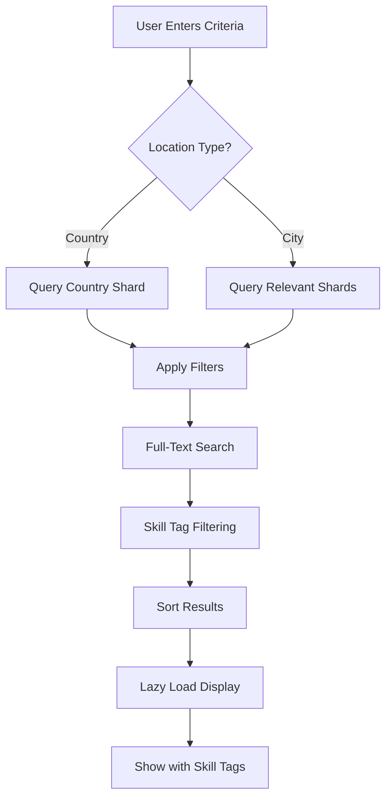

## Overview

The Applicant Search module enables companies to proactively search for qualified candidates based on various criteria including location, education, experience, and technical skills.

## Search Criteria

### Simplex Level (5.1.1 - 5.1.4)

<CardGroup cols={2}>
  <Card title="Location" icon="location-dot">
    - City OR Country (select one)
    - Single value per search
  </Card>
  <Card title="Education" icon="graduation-cap">
    - Bachelor
    - Master
    - Doctorate
  </Card>
  <Card title="Work Experience" icon="briefcase">
    - None
    - Any
    - Keyword search (case-insensitive)
  </Card>
  <Card title="Employment Types" icon="clock">
    Multiple selection allowed:
    - Full-time
    - Part-time
    - Internship
    - Contract
  </Card>
</CardGroup>

### Search Result Display

**Basic Information Shown:**
- First Name
- Last Name
- Email
- City
- Country
- Highest Education Degree

**Detailed View:**
Click on applicant to see:
- All basic information above
- Education history
- Work Experience details
- Objective Summary

## Medium Level Features

### Full-Text Search (5.2.1)

<Accordion title="FTS Capabilities">
Search across multiple fields simultaneously:
- Work Experience
- Objective Summary
- Technical Skills

**Example:**
Search for "software engineer python" finds applicants with these terms in any of the three fields.
</Accordion>

### Technical Skills Filtering (5.2.2)

<Warning>
Uses OR logic for multiple skills
</Warning>

**Skill Tag Search:**
- Filter by technical skill tags
- Example: Search for "Kafka, Java, MongoDB"
- Returns applicants with Kafka OR Java OR MongoDB
- Not all three skills required

**Common Skill Tags:**
- Languages: Python, Java, JavaScript, Go, Rust
- Frameworks: React, Spring Boot, Django, Angular
- Databases: MongoDB, PostgreSQL, MySQL, Redis
- Tools: Docker, Kubernetes, Kafka, Git

### Performance Optimizations

<AccordionGroup>
  <Accordion title="Lazy Loading (5.2.3)">
    - Search results loaded incrementally
    - Improves performance with large datasets
    - Smooth scrolling experience
    - Reduces initial load time
  </Accordion>

  <Accordion title="Responsive Design (5.2.4)">
    Search page responsive to:
    - Desktop devices
    - Mobile devices
    - Tablet devices
    - Adaptive layout and controls
  </Accordion>
</AccordionGroup>

### Skill Tags Display (5.2.5)

<Card title="Visual Skill Indicators" icon="tags">
Each applicant result displays their skill tags for quick assessment:
- Color-coded tags
- Easy visual scanning
- Quick skill matching
</Card>

## Ultimo Level Features

### Database Sharding Optimization (5.3.1)

<Warning>
Requires database sharding implementation
</Warning>

**Sharding Strategy:**
- Use Country as sharding key
- Queries routed to relevant shard only
- Significantly improves search performance
- Reduces database load

**Default Behavior:**
- System defaults to Vietnam location
- Can be changed by user
- Optimizes for primary user base

### Applicant Marking System (5.3.2)

<Tabs>
  <Tab title="Favorite">
    - Mark promising candidates
    - Quick access for future reference
    - Indicated in search results
    - Company-specific favorites
  </Tab>
  <Tab title="Warning">
    - Flag concerning applicants
    - Warning indicator in results
    - Company-specific warnings
    - Internal tracking only
  </Tab>
</Tabs>

**Marking Contexts:**
- From profile view
- From job application review
- Visual indicators in search results

## Search Interface

### Basic Search Example

```typescript
{
  "location": {
    "type": "COUNTRY",
    "value": "Vietnam"
  },
  "education": ["BACHELOR", "MASTER"],
  "workExperience": {
    "type": "KEYWORD",
    "value": "software engineer"
  },
  "employmentTypes": ["FULL_TIME", "INTERNSHIP"]
}
```

### Advanced Search with Skills

```typescript
{
  "location": {
    "type": "CITY",
    "value": "Ho Chi Minh City"
  },
  "skills": ["React", "Spring Boot", "Docker"],
  "education": ["MASTER"],
  "fullTextSearch": "backend development microservices"
}
```

## Search Flow



## Implementation Guidelines

### Case-Insensitive Search

<Info>
All text searches must be case-insensitive to ensure comprehensive results
</Info>

**Examples:**
- "Software Engineer" = "software engineer" = "SOFTWARE ENGINEER"
- "python" = "Python" = "PYTHON"

### Performance Considerations

<Steps>
  <Step title="Index Fields">
    Create database indexes on searchable fields
  </Step>
  <Step title="Use FTS Engine">
    Implement full-text search engine (Elasticsearch, MongoDB Atlas Search)
  </Step>
  <Step title="Implement Pagination">
    Use cursor-based or offset pagination for lazy loading
  </Step>
  <Step title="Cache Results">
    Cache frequently accessed searches in Redis
  </Step>
</Steps>

## Data Integration

<Warning>
Applicant profile data must be consumed from Job Applicant subsystem API
</Warning>

**Required API Calls:**
- GET /api/applicants/search
- GET /api/applicants/{id}/profile
- GET /api/applicants/{id}/documents

## Related Documentation

- [Job Post Management](/features/job-management)
- [Premium Features](/features/premium-features)
- [API Reference](/api-reference/introduction)
