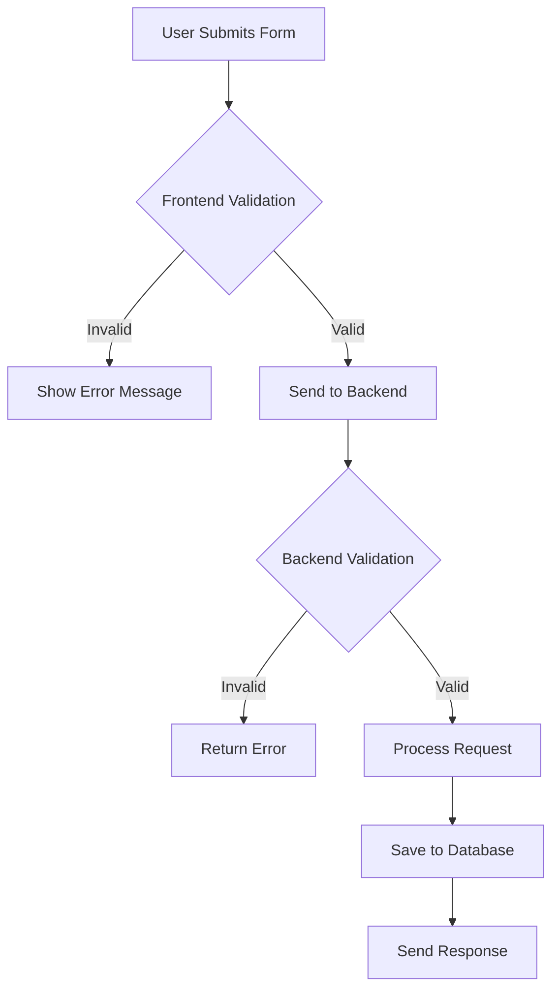

## Overview

The Authentication module handles company registration and login for the Job Manager subsystem, providing secure access control with multiple authentication methods.

## Company Registration

### Registration Interface

### Simplex Level (Basic)

<AccordionGroup>
  <Accordion title="Registration Form (1.1.1)">
    The system provides a registration form with:
    - **Required fields**: Email, Password, Country
    - **Optional fields**: Phone Number, Street Name/Number, City
  </Accordion>

  <Accordion title="Unique Email Constraint (1.1.2)">
    The system enforces unique email addresses - no two companies can share the same email in the database.
  </Accordion>

  <Accordion title="Account Activation (1.1.3)">
    - System sends activation email to new companies
    - Companies can only login after account activation
  </Accordion>

  <Accordion title="Country Selection (1.2.4)">
    Country must be selected from a dropdown list, not entered as text.
  </Accordion>
</AccordionGroup>

### Medium Level

<AccordionGroup>
  <Accordion title="Password Validation (1.2.1)">
    Password must meet the following criteria:
    - At least 8 characters
    - At least 1 number
    - At least 1 special character ($#@!)
    - At least 1 capitalized letter
  </Accordion>

  <Accordion title="Email Validation (1.2.2)">
    Email must meet standard formatting:
    - Contains exactly one '@' symbol
    - At least one '.' after the '@'
    - Total length less than 255 characters
    - No spaces or prohibited characters (; : ( ))
  </Accordion>

  <Accordion title="Phone Number Validation (1.2.3)">
    If provided, phone number must:
    - Contain only digits
    - Start with valid international dial code (+84, +49, etc.)
    - Digits after dial code must be less than 13
  </Accordion>

  <Accordion title="Frontend & Backend Validation (1.2.4)">
    - **Frontend**: Quick user feedback
    - **Backend**: Security validation
    - Clear error messages displayed to users
  </Accordion>
</AccordionGroup>

### Ultimo Level (Advanced)

<AccordionGroup>
  <Accordion title="SSO Registration (1.3.1)">
    Support registration via Single Sign-On from ONE platform:
    - Google
    - Microsoft
    - Facebook
    - GitHub

    Can use personal email for this project.
  </Accordion>

  <Accordion title="SSO Profile Persistence (1.3.2)">
    - System persists core company profile (name, email, country)
    - SSO users cannot use password for system access
  </Accordion>

  <Accordion title="Database Sharding (1.3.3)">
    - Select user attribute as sharding key
    - Partition and store data in designated shard
    - Enhance search algorithm performance
  </Accordion>
</AccordionGroup>

## Company Login

### Login Interface

### Simplex Level

<AccordionGroup>
  <Accordion title="Basic Authentication (2.1.1)">
    System authenticates using email and password:
    - **No HTTPS**: Use Basic Authentication format
    - **With HTTPS**: Send credentials in request body plaintext
  </Accordion>

  <Accordion title="JWS Token (2.1.2)">
    Upon successful login:
    - Generate JSON Web Signature (JWS) token
    - Contains signed user identity data (ID, Role)
    - Verifies token integrity
  </Accordion>
</AccordionGroup>

### Medium Level

<AccordionGroup>
  <Accordion title="JWE Token (2.2.1)">
    Generate JSON Web Encryption (JWE) token instead of JWS:
    - Contains user identity (ID, Role)
    - Payload is encrypted
    - Cannot be read by unauthorized parties
  </Accordion>

  <Accordion title="Brute-Force Prevention (2.2.2)">
    - Block authentication after 5 failed attempts
    - Within 60-second window
    - Prevents brute-force attacks
  </Accordion>

  <Accordion title="Token Invalidation (2.2.3)">
    Invalidate and revoke JWE token when:
    - User explicitly logs out
    - Token reaches expiration time
  </Accordion>
</AccordionGroup>

### Ultimo Level

<AccordionGroup>
  <Accordion title="SSO Login (2.3.1)">
    Support login using account from selected external platform (same as registration).
  </Accordion>

  <Accordion title="Redis Token Cache (2.3.2)">
    - Dedicated Redis cache for token revocation status
    - Quick check for non-SSO accounts
    - Improves security performance
  </Accordion>

  <Accordion title="Token Refresh Mechanism (2.3.3)">
    For non-SSO accounts:
    - Short-lived Access Token
    - Longer-lived Refresh Token
    - Maintain session without frequent re-authentication
  </Accordion>
</AccordionGroup>

## Implementation Guidelines

### Security Best Practices

<Warning>
Never implement the following vulnerabilities:
- Storing passwords in plaintext
- SQL injection vulnerabilities
- XSS vulnerabilities
- Command injection
- Insufficient token expiration
</Warning>

### Validation Flow

## Testing Requirements

<Checklist>
  <Check>Test all validation rules (frontend and backend)</Check>
  <Check>Test unique email constraint</Check>
  <Check>Test password strength requirements</Check>
  <Check>Test SSO integration (if implementing Ultimo)</Check>
  <Check>Test brute-force prevention</Check>
  <Check>Test token generation and validation</Check>
  <Check>Test token refresh mechanism</Check>
</Checklist>

## Related Documentation

- [Profile Management](/features/profile-management)
- [Premium Features](/features/premium-features)
- [API Reference](/api-reference/introduction)
