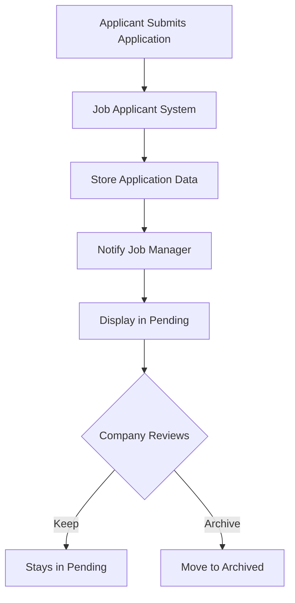

## Overview

The Job Post Management module enables companies to create, publish, and manage job listings while tracking applications from candidates.

## Core Features

### Job Management Interface

<Tabs>
  <Tab title="Jobs List">
    
  </Tab>
  <Tab title="Job Detail">
    
  </Tab>
  <Tab title="Salary Options">
    
  </Tab>
</Tabs>

### Simplex Level (4.1.1)

<Card title="Job Post CRUD" icon="clipboard-list">
Manage public and private job posts with the following fields:

**Required Fields:**
- Title
- Description
- Employment Type
- Posted Date
- Salary
- Location

**Optional Fields:**
- Expiry Date
</Card>

### Employment Types

<Tabs>
  <Tab title="Working Hours">
    - Full-time OR Part-time
    - Mutually exclusive selection
  </Tab>
  <Tab title="Position Type">
    - Internship
    - Contract
    - Can be combined (e.g., Internship + Contract)
  </Tab>
</Tabs>

### Salary Formats

Job posts can specify salary in three formats:

<CardGroup cols={3}>
  <Card title="Range" icon="arrows-left-right">
    1000 - 1500 USD
  </Card>
  <Card title="Estimation" icon="approximately-equal">
    - About 1000 USD
    - Up to 2000 USD
    - From 3000 USD
  </Card>
  <Card title="Negotiable" icon="handshake">
    Salary to be discussed
  </Card>
</CardGroup>

## Medium Level Features

### Technical Skills Tagging (4.2.1)

<Accordion title="Skills and Competencies Management">
Tag and manage technical requirements for each job post:

**Examples:**
- Programming languages: Python, Java, JavaScript
- Frameworks: React, Spring Boot, Django
- Tools: Docker, Kafka, Redis
- Cloud: AWS, Azure, GCP

**Features:**
- Add multiple skill tags
- Remove skill tags
- Search and filter by skills
- Display skills on job listings
</Accordion>

### Application Management (4.2.2)

#### Application Interface

<Tabs>
  <Tab title="Applicants List">
    
  </Tab>
  <Tab title="Applicant Detail">
    
  </Tab>
</Tabs>

<AccordionGroup>
  <Accordion title="Application Categories">
    Applications are organized into two categories:

    **Pending**
    - Newly submitted applications
    - Newest on top
    - Awaiting company review

    **Archived**
    - Applications moved from Pending
    - Company has reviewed
    - Removed from active list
  </Accordion>

  <Accordion title="Application Display">
    For each application, display:
    - Applicant information
    - Cover Letter (if provided)
    - Submission date
    - Status (Pending/Archived)

    <Info>
    Job Applicant team handles application data persistence
    </Info>
  </Accordion>
</AccordionGroup>

## Ultimo Level Features

### Real-Time Notifications (4.3.1)

<Warning>
Requires Kafka implementation for pub/sub messaging
</Warning>

**Profile Update Propagation**
- Changes to job post propagated to Kafka topic
- Triggers when company modifies:
  - Required skills
  - Job location/country
- Notifies subscribed premium applicants
- Applicants matched by technical background and country

### Document Management (4.3.2)

<Card title="View Application Documents" icon="file">
Enable viewing of application materials:
- Curriculum Vitae (CV) files
- Cover Letter files
- PDF, DOCX format support
- Secure document access
</Card>

## Visibility Control

### Public vs Private Posts

<Tabs>
  <Tab title="Public Posts">
    - Visible to all job seekers
    - Published by company
    - Searchable in system
    - Can receive applications
  </Tab>
  <Tab title="Private Posts">
    - Not publicly visible
    - Draft or unpublished
    - Only visible to company
    - Cannot receive applications
  </Tab>
</Tabs>

## Implementation Examples

### Create Job Post API

```json
POST /api/companies/{companyId}/jobs

{
  "title": "Senior Full-Stack Developer",
  "description": "We are looking for an experienced full-stack developer...",
  "employmentType": ["FULL_TIME", "CONTRACT"],
  "location": "Ho Chi Minh City, Vietnam",
  "salary": {
    "type": "RANGE",
    "min": 2000,
    "max": 3500,
    "currency": "USD"
  },
  "skills": ["React", "Spring Boot", "Docker", "Kafka"],
  "expiryDate": "2026-03-31",
  "isPublic": true
}
```

### Archive Application API

```json
PATCH /api/jobs/{jobId}/applications/{applicationId}/archive

{
  "status": "ARCHIVED",
  "note": "Position filled"
}
```

## Application Flow



## Related Documentation

- [Applicant Search](/features/applicant-search)
- [Premium Features](/features/premium-features)
- [API Reference](/api-reference/introduction)
