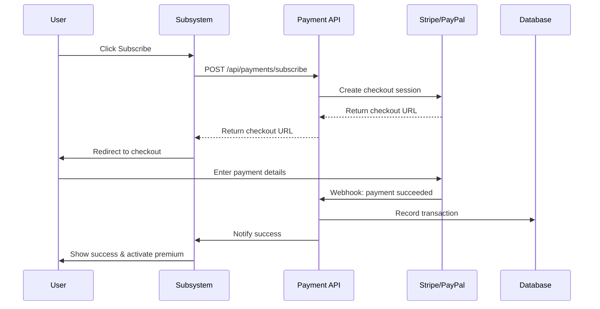

## Overview

The Payment Service is a shared API developed by the Job Manager team that enables both Job Applicants and Companies to subscribe to premium features.

<Info>
This is a **shared service** used by both Job Manager and Job Applicant subsystems.
</Info>

## Service Responsibility

### Simplex Level (6.1.1)

<Card title="Payment API Development" icon="code">
The Job Manager team develops a centralized Payment API that:
- Accepts subscription requests from both subsystems
- Integrates with third-party payment providers
- Processes credit card payments
- Returns payment confirmation
</Card>

### Supported Payment Providers

<Tabs>
  <Tab title="Stripe">
    **Recommended Provider**
    - Industry-standard security
    - PCI DSS compliant
    - Comprehensive API
    - Webhook support
    - Test mode available
  </Tab>
  <Tab title="PayPal">
    **Alternative Provider**
    - Wide user adoption
    - Secure checkout
    - REST API integration
    - Sandbox environment
  </Tab>
</Tabs>

## Transaction Recording

### Medium Level (6.1.2)

<Warning>
All payment transactions must be recorded in the database
</Warning>

**Required Transaction Data:**
- Applicant/Company email
- Transaction timestamp
- Transaction status
- Payment amount
- Payment method
- Transaction ID (from provider)

### Transaction Status

<CardGroup cols={3}>
  <Card title="SUCCESS" icon="check">
    Payment completed successfully
  </Card>
  <Card title="PENDING" icon="clock">
    Payment processing
  </Card>
  <Card title="FAILED" icon="xmark">
    Payment failed or declined
  </Card>
  <Card title="REFUNDED" icon="rotate-left">
    Payment refunded to user
  </Card>
  <Card title="CANCELLED" icon="ban">
    User cancelled payment
  </Card>
</CardGroup>

## API Endpoints

### Subscribe to Premium

```http
POST /api/payments/subscribe
Content-Type: application/json
Authorization: Bearer {jwt_token}

{
  "userType": "COMPANY" | "APPLICANT",
  "userId": "uuid",
  "email": "company@example.com",
  "plan": "MONTHLY",
  "paymentMethod": "STRIPE" | "PAYPAL",
  "returnUrl": "https://app.devision.com/subscription/success",
  "cancelUrl": "https://app.devision.com/subscription/cancel"
}
```

**Response:**
```json
{
  "transactionId": "txn_abc123",
  "status": "PENDING",
  "checkoutUrl": "https://checkout.stripe.com/...",
  "expiresAt": "2026-01-10T10:30:00Z"
}
```

### Verify Payment

```http
GET /api/payments/verify/{transactionId}
Authorization: Bearer {jwt_token}

Response:
{
  "transactionId": "txn_abc123",
  "status": "SUCCESS",
  "email": "company@example.com",
  "amount": 30.00,
  "currency": "USD",
  "timestamp": "2026-01-10T10:25:00Z",
  "subscriptionStartDate": "2026-01-10",
  "subscriptionEndDate": "2026-02-10"
}
```

### Payment Webhook

```http
POST /api/payments/webhook/stripe
Content-Type: application/json
Stripe-Signature: {signature}

{
  "type": "payment_intent.succeeded",
  "data": {
    "object": {
      "id": "pi_abc123",
      "amount": 3000,
      "currency": "usd",
      "customer": "cus_xyz789",
      "metadata": {
        "userId": "uuid",
        "userType": "COMPANY"
      }
    }
  }
}
```

## Payment Flow

### Subscription Process

<Steps>
  <Step title="Initiate Subscription">
    User clicks "Subscribe to Premium" in their subsystem
  </Step>
  <Step title="Create Payment Intent">
    Subsystem calls Payment API to create payment intent
  </Step>
  <Step title="Redirect to Checkout">
    User redirected to Stripe/PayPal checkout page
  </Step>
  <Step title="Complete Payment">
    User enters payment details and confirms
  </Step>
  <Step title="Webhook Notification">
    Payment provider sends webhook to Payment API
  </Step>
  <Step title="Update Database">
    Payment API records transaction and updates subscription status
  </Step>
  <Step title="Notify Subsystem">
    Payment API notifies requesting subsystem of success
  </Step>
  <Step title="Activate Premium">
    Subsystem activates premium features for user
  </Step>
</Steps>



## Security Requirements

### PCI DSS Compliance

<Warning>
Never store credit card details directly. Use payment provider's tokenization.
</Warning>

**Security Measures:**
- All payment data transmitted over HTTPS
- Use payment provider's hosted checkout
- Implement webhook signature verification
- Store only tokenized payment methods
- Log all payment attempts for audit

### Webhook Verification

```java
@PostMapping("/webhook/stripe")
public ResponseEntity<?> handleStripeWebhook(
    @RequestBody String payload,
    @RequestHeader("Stripe-Signature") String signature
) {
    try {
        Event event = Webhook.constructEvent(
            payload,
            signature,
            webhookSecret
        );

        // Process verified event
        processPaymentEvent(event);

        return ResponseEntity.ok().build();
    } catch (SignatureVerificationException e) {
        // Invalid signature - reject
        return ResponseEntity.status(400).build();
    }
}
```

## Database Schema

```sql
CREATE TABLE payment_transactions (
    id UUID PRIMARY KEY,
    user_type VARCHAR(20) NOT NULL, -- COMPANY or APPLICANT
    user_id UUID NOT NULL,
    user_email VARCHAR(255) NOT NULL,

    amount DECIMAL(10,2) NOT NULL,
    currency VARCHAR(3) DEFAULT 'USD',

    status VARCHAR(20) NOT NULL,
    payment_method VARCHAR(50) NOT NULL,
    payment_provider VARCHAR(50) NOT NULL,

    provider_transaction_id VARCHAR(255) UNIQUE,
    provider_customer_id VARCHAR(255),

    subscription_start_date DATE,
    subscription_end_date DATE,

    created_at TIMESTAMP DEFAULT NOW(),
    updated_at TIMESTAMP DEFAULT NOW(),

    metadata JSONB,

    INDEX idx_user (user_id, user_type),
    INDEX idx_email (user_email),
    INDEX idx_status (status),
    INDEX idx_created (created_at DESC)
);

CREATE TABLE payment_webhooks (
    id UUID PRIMARY KEY,
    provider VARCHAR(50) NOT NULL,
    event_type VARCHAR(100) NOT NULL,
    event_id VARCHAR(255) UNIQUE,
    payload JSONB NOT NULL,
    processed BOOLEAN DEFAULT FALSE,
    created_at TIMESTAMP DEFAULT NOW()
);
```

## Error Handling

### Common Error Scenarios

<AccordionGroup>
  <Accordion title="Payment Declined">
    **Status Code:** 402 Payment Required

    ```json
    {
      "error": "PAYMENT_DECLINED",
      "message": "Your payment method was declined",
      "code": "card_declined"
    }
    ```
  </Accordion>

  <Accordion title="Insufficient Funds">
    **Status Code:** 402 Payment Required

    ```json
    {
      "error": "INSUFFICIENT_FUNDS",
      "message": "Insufficient funds in account",
      "code": "insufficient_funds"
    }
    ```
  </Accordion>

  <Accordion title="Network Timeout">
    **Status Code:** 504 Gateway Timeout

    ```json
    {
      "error": "PAYMENT_TIMEOUT",
      "message": "Payment provider did not respond in time",
      "transactionId": "txn_abc123",
      "retry": true
    }
    ```
  </Accordion>

  <Accordion title="Already Subscribed">
    **Status Code:** 409 Conflict

    ```json
    {
      "error": "ALREADY_SUBSCRIBED",
      "message": "User already has an active subscription",
      "expiresAt": "2026-02-10"
    }
    ```
  </Accordion>
</AccordionGroup>

## Testing

### Test Mode Configuration

<Tabs>
  <Tab title="Stripe Test Cards">
    ```
    Success: 4242 4242 4242 4242
    Declined: 4000 0000 0000 0002
    Insufficient Funds: 4000 0000 0000 9995
    Processing Error: 4000 0000 0000 0119

    Expiry: Any future date
    CVV: Any 3 digits
    ZIP: Any 5 digits
    ```
  </Tab>
  <Tab title="PayPal Sandbox">
    Use PayPal Sandbox accounts for testing:
    - Create test business account
    - Create test personal account
    - Use sandbox credentials in environment variables
  </Tab>
</Tabs>

### Test Checklist

<Checklist>
  <Check>Successful payment flow</Check>
  <Check>Declined payment handling</Check>
  <Check>Webhook signature verification</Check>
  <Check>Transaction recording in database</Check>
  <Check>Duplicate payment prevention</Check>
  <Check>Refund processing</Check>
  <Check>Email notifications</Check>
  <Check>Concurrent payment handling</Check>
</Checklist>

## Integration Examples

### Job Manager Integration

```typescript
// Company subscribes to premium
async function subscribeToPremium(companyId: string) {
  const response = await fetch('/api/payments/subscribe', {
    method: 'POST',
    headers: {
      'Content-Type': 'application/json',
      'Authorization': `Bearer ${token}`
    },
    body: JSON.stringify({
      userType: 'COMPANY',
      userId: companyId,
      email: company.email,
      plan: 'MONTHLY',
      paymentMethod: 'STRIPE'
    })
  });

  const { checkoutUrl } = await response.json();
  window.location.href = checkoutUrl;
}
```

### Job Applicant Integration

```typescript
// Applicant subscribes to premium
async function subscribeToJobAlerts(applicantId: string) {
  const response = await fetch('/api/payments/subscribe', {
    method: 'POST',
    headers: {
      'Content-Type': 'application/json',
      'Authorization': `Bearer ${token}`
    },
    body: JSON.stringify({
      userType: 'APPLICANT',
      userId: applicantId,
      email: applicant.email,
      plan: 'MONTHLY',
      paymentMethod: 'STRIPE'
    })
  });

  const { checkoutUrl } = await response.json();
  window.location.href = checkoutUrl;
}
```

## Related Documentation

- [Premium Features](/features/premium-features)
- [Architecture](/technical/architecture)
- [API Reference](/api-reference/introduction)
