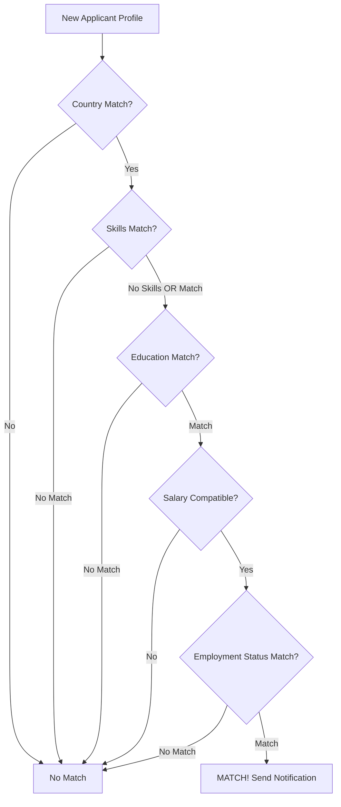

## Overview

The Premium Subscription feature enables companies to access advanced capabilities, including real-time notifications when new applicants match their specific hiring criteria.

## Subscription Model

### Pricing (6.1.1)

<Card title="Monthly Subscription" icon="credit-card">
**$30 USD per month**

Companies can subscribe using third-party payment systems:
- Stripe
- PayPal

The system records and displays premium status on the company profile page.
</Card>

### Expiration Notifications (6.1.2)

<AccordionGroup>
  <Accordion title="7-Day Warning">
    Email notification sent **7 days before** subscription expires:
    - Subscription end date
    - Renewal instructions
    - Link to payment portal
  </Accordion>

  <Accordion title="Expiration Notice">
    Email sent when subscription **officially expires**:
    - Service termination notice
    - Features lost with expiration
    - Renewal options
  </Accordion>
</AccordionGroup>

## Applicant Search Profile

### Medium Level (6.2.1 - 6.2.4)

Premium companies can define and save custom search profiles for automatic candidate matching.

<CardGroup cols={2}>
  <Card title="Technical Background" icon="code">
    **Skill Tags (6.2.2)**
    - React
    - Spring Boot
    - Kafka
    - Docker
    - Python
    - AWS
    - Snowflake

    Tags enable efficient matching against applicant profiles
  </Card>

  <Card title="Employment Status" icon="briefcase">
    **Multiple Selection (6.2.3)**
    - Full-time
    - Part-time
    - Fresher
    - Internship
    - Contract

    If neither Full-time nor Part-time specified, both are included in matching
  </Card>

  <Card title="Location" icon="location-dot">
    **Country Filter**
    - Specify desired country
    - Matches applicants in that location
    - Used for sharding optimization
  </Card>

  <Card title="Salary Range" icon="dollar-sign">
    **Flexible Range (6.2.4)**
    - Minimum amount (defaults to 0 if not set)
    - Maximum amount (no limit if not set)
    - Includes applicants with undeclared salary

    Example: 1000 - 2500 USD
  </Card>
</CardGroup>

### Education Requirements

<Card title="Highest Education Degree" icon="graduation-cap">
Premium companies can specify desired education level:
- Bachelor's degree
- Master's degree
- Doctorate degree
</Card>

## Real-Time Notifications

### Ultimo Level (6.3.1)

<Warning>
Requires Kafka messaging platform implementation
</Warning>

**Real-Time Matching Service**

The system implements an event-driven notification service:

<Steps>
  <Step title="Profile Change Event">
    Job Applicant creates or edits their profile
  </Step>
  <Step title="Kafka Producer">
    Job Applicant system publishes event to Kafka topic
  </Step>
  <Step title="Kafka Consumer">
    Dedicated consumer service in Job Manager system listens to topic
  </Step>
  <Step title="Match Evaluation">
    Consumer evaluates profile against ALL active premium company criteria
  </Step>
  <Step title="Notification Delivery">
    For each match, system delivers immediate real-time notification
  </Step>
</Steps>

### Notification Delivery

<Tabs>
  <Tab title="WebSocket">
    Real-time push notifications to active browser sessions
  </Tab>
  <Tab title="Email">
    Email notification for offline companies
  </Tab>
  <Tab title="In-App">
    Notification center with unread count
  </Tab>
</Tabs>

## Search Profile Examples

### Software Engineer Profile

```json
{
  "profileName": "Full-Stack Software Engineers",
  "technicalSkills": ["React", "Spring Boot", "Docker"],
  "employmentStatus": ["FULL_TIME", "INTERNSHIP"],
  "country": "Vietnam",
  "salaryRange": {
    "min": 800,
    "max": null,
    "currency": "USD"
  },
  "education": ["BACHELOR", "MASTER"]
}
```

### Data Engineer Profile

```json
{
  "profileName": "Contractual Data Engineers",
  "technicalSkills": ["Python", "AWS", "Snowflake"],
  "employmentStatus": ["CONTRACT"],
  "country": "Singapore",
  "salaryRange": {
    "min": 1200,
    "max": null,
    "currency": "USD"
  },
  "education": ["MASTER", "DOCTORATE"]
}
```

## Matching Logic

### Criteria Evaluation



### Skills Matching

<Info>
Skills use OR logic - applicant needs at least ONE matching skill from the company's required skills list.
</Info>

**Example:**
- Company requires: React, Spring Boot, Docker
- Applicant has: React, Python
- **Result**: MATCH (React matches)

### Salary Compatibility

The system includes applicants when:
- Applicant's desired salary is within company's range
- Applicant hasn't specified a desired salary
- Company's max salary is not set (open-ended)

## Premium Features Summary

<CardGroup cols={2}>
  <Card title="Real-Time Alerts" icon="bell">
    Instant notifications when candidates match your criteria
  </Card>
  <Card title="Custom Search Profiles" icon="magnifying-glass">
    Save and manage multiple candidate search profiles
  </Card>
  <Card title="Priority Support" icon="headset">
    Dedicated support for premium subscribers
  </Card>
  <Card title="Advanced Analytics" icon="chart-line">
    Detailed insights on candidate matches and trends
  </Card>
</CardGroup>

## Implementation Requirements

### Database Schema

```sql
CREATE TABLE premium_subscriptions (
    id UUID PRIMARY KEY,
    company_id UUID NOT NULL,
    start_date TIMESTAMP NOT NULL,
    end_date TIMESTAMP NOT NULL,
    status VARCHAR(20) NOT NULL,
    payment_method VARCHAR(50),
    created_at TIMESTAMP DEFAULT NOW()
);

CREATE TABLE search_profiles (
    id UUID PRIMARY KEY,
    company_id UUID NOT NULL,
    profile_name VARCHAR(255) NOT NULL,
    technical_skills TEXT[],
    employment_status TEXT[],
    country VARCHAR(100),
    min_salary DECIMAL(10,2),
    max_salary DECIMAL(10,2),
    education_levels TEXT[],
    is_active BOOLEAN DEFAULT TRUE,
    created_at TIMESTAMP DEFAULT NOW()
);
```

### Kafka Topics

**Topic: applicant-profile-updates**
```json
{
  "eventType": "PROFILE_CREATED | PROFILE_UPDATED",
  "applicantId": "uuid",
  "timestamp": "2026-01-10T10:30:00Z",
  "data": {
    "skills": ["React", "Python"],
    "country": "Vietnam",
    "desiredSalary": 1500,
    "education": "BACHELOR",
    "employmentPreferences": ["FULL_TIME", "INTERNSHIP"]
  }
}
```

## Testing Scenarios

<Checklist>
  <Check>Premium subscription purchase flow</Check>
  <Check>Payment integration with Stripe/PayPal</Check>
  <Check>Email notifications at 7 days before expiry</Check>
  <Check>Email notifications on expiration</Check>
  <Check>Search profile creation and editing</Check>
  <Check>Real-time matching algorithm</Check>
  <Check>Kafka event publishing and consumption</Check>
  <Check>WebSocket notification delivery</Check>
  <Check>Multiple concurrent matches handling</Check>
</Checklist>

## Related Documentation

- [Payment Service](/features/payment-service)
- [Applicant Search](/features/applicant-search)
- [Architecture](/technical/architecture)
