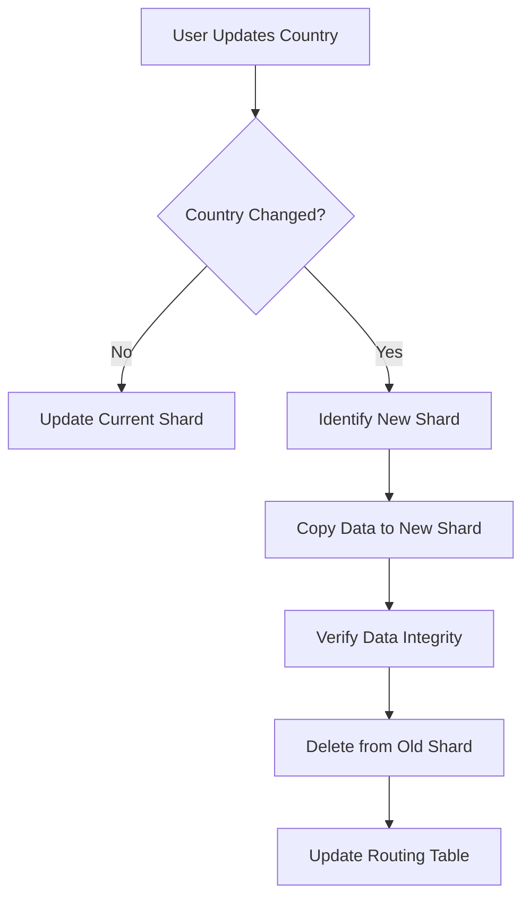

## Overview

The Profile Management module allows companies to create, edit, and showcase their organizational profile to attract potential candidates.

## Core Profile Features

### Profile Interface

<Tabs>
  <Tab title="Profile View">
    
  </Tab>
  <Tab title="Edit Mode">
    
  </Tab>
  <Tab title="Activity Post">
    
  </Tab>
</Tabs>

### Simplex Level (3.1.1)

<Card title="Basic Profile Editing" icon="pen">
Companies can edit their core contact information:
- Email
- Company Name
- Password
- Phone Number
- Address
- City
- Country
</Card>

### Medium Level

<AccordionGroup>
  <Accordion title="Public Profile Configuration (3.2.1)">
    Create and configure public-facing company profile:
    - **Company Name**: Official organization name
    - **About Us**: Company description and mission
    - **Who We're Looking For**: Desired employee personalities and culture fit
  </Accordion>

  <Accordion title="Logo Upload (3.2.2)">
    - Upload company logo picture
    - Automatic image resizing to standard size
    - Optimized for display performance
  </Accordion>
</AccordionGroup>

### Ultimo Level (3.3.1)

<Warning>
Advanced feature requiring database sharding implementation
</Warning>

**Profile Modification with Data Migration**
- All changes persisted immediately to database shard
- If Country field changes: automatic data migration to new shard
- Entire user record moved to corresponding database shard

## Additional Features

### Media Showcase

<Card title="Images and Videos" icon="image">
Upload multimedia content to showcase:
- Company events
- Office culture
- Team activities
- Company mottos and values
</Card>

## Implementation Guidelines

### Image Upload Requirements

<Steps>
  <Step title="File Upload">
    Accept image files (PNG, JPG, SVG)
  </Step>
  <Step title="Validation">
    Validate file type and size limits
  </Step>
  <Step title="Resize">
    Automatically resize to standard dimensions
  </Step>
  <Step title="Storage">
    Store optimized image in media storage
  </Step>
</Steps>

### Data Migration Process



## API Endpoints

### Update Company Profile
```http
PUT /api/companies/{id}/profile
Content-Type: application/json

{
  "name": "Tech Corp",
  "aboutUs": "Leading software company",
  "whoWeAreLookingFor": "Passionate developers",
  "phone": "+84123456789",
  "address": "123 Tech Street",
  "city": "Ho Chi Minh City",
  "country": "Vietnam"
}
```

### Upload Logo
```http
POST /api/companies/{id}/logo
Content-Type: multipart/form-data

logo: [file]
```

## Related Documentation

- [Authentication](/features/authentication)
- [Job Post Management](/features/job-management)
- [API Reference](/api-reference/introduction)
