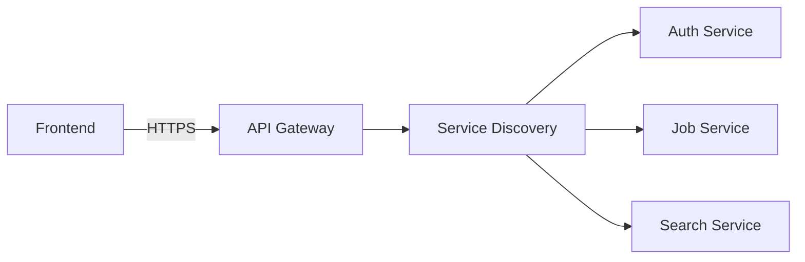
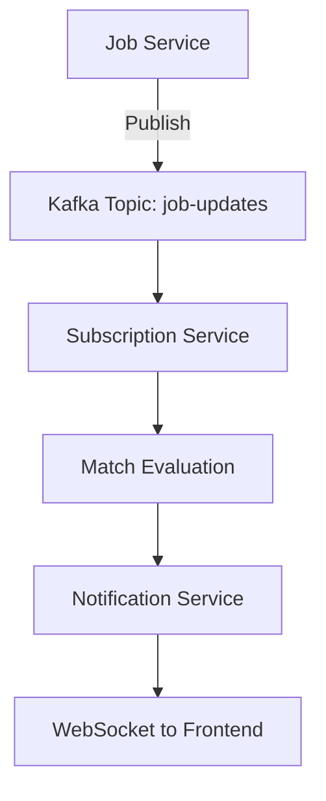

## Architecture Overview

SGJM Team is implementing the **Ultimo (Advanced)** architecture specification, featuring microservices backend, headless UI frontend, and event-driven communication.

## Target Architecture

<CardGroup cols={2}>
  <Card title="Frontend" icon="desktop">
    **Headless UI Architecture** - React with TanStack Query & Router - Zustand
    for state management - Shadcn/ui with Tailwind CSS - Reusable headless
    components
  </Card>
  <Card title="Backend" icon="server">
    **Microservices Architecture** - Spring Boot services - Bounded context per
    service - Database per service - Database sharding by Country
  </Card>
  <Card title="Messaging" icon="message">
    **Kafka Message Broker** - Real-time event streaming - Cross-subsystem
    communication - Pub/sub for notifications
  </Card>
  <Card title="Deployment" icon="docker">
    **Containerized Infrastructure** - Dockerized services - Service Discovery -
    API Gateway - Multi-host deployment
  </Card>
</CardGroup>

## Architecture Levels

### Simplex (Basic) - N-Tier Architecture

<Info>Foundation layer-based architecture separating concerns</Info>

**Layer Hierarchy (A.1.1, A.1.2):**

<Steps>
  <Step title="Presentation Layer">
    Controllers handling HTTP requests and responses
  </Step>
  <Step title="Business Logic Layer">
    Services implementing business rules and workflows
  </Step>
  <Step title="Repository Layer">
    Query definitions and execution (separate from DAO)
  </Step>
  <Step title="Data Access Layer">Database entities and mappings</Step>
</Steps>

**Additional Features (A.1.3):**

- Cookie Configuration
- Security Filters
- Token Generators
- Exception Handlers

### Medium - Modular Monolith Architecture

<Warning>Each module maintains strict bounded context</Warning>

**Module Structure (A.2.1, A.2.2):**

```
job-manager-backend/
├── auth-module/
│   ├── presentation/    # Controllers
│   ├── business/        # Services
│   ├── repository/      # Queries
│   └── domain/          # Entities
├── profile-module/
├── job-module/
├── search-module/
└── payment-module/
```

**API Organization (A.2.3, A.2.4, A.2.5):**

<Tabs>
  <Tab title="External APIs">
    **Public Services** exposed via interfaces - Available to other modules -
    Defined contracts - Versioned endpoints
  </Tab>
  <Tab title="Internal APIs">
    **Private Services** used within module - Not accessible to other modules -
    Implementation details hidden - Can change without affecting others
  </Tab>
</Tabs>

**Data Transfer (A.2.6):**

- External DTOs: Shared across modules
- Internal DTOs: Module-private only
- Minimize data exposure in responses

**Frontend Organization (A.2.a, A.2.b, A.2.c):**

```
job-manager-frontend/
├── components/
│   ├── common/           # Reusable UI elements
│   │   ├── Button/
│   │   ├── Input/
│   │   └── Card/
│   ├── auth/
│   │   ├── LoginForm/
│   │   │   ├── index.tsx       # Presentation
│   │   │   ├── hooks.ts        # Event handlers
│   │   │   ├── service.ts      # API calls
│   │   │   └── styles.css      # Styling
│   │   └── RegisterForm/
│   └── jobs/
└── utils/
    └── http-helper.ts    # REST HTTP Helper
```

### Ultimo - Microservices Architecture

<Card title="Advanced Distributed Architecture" icon="diagram-project">
  Fully distributed system with independent services, databases, and deployment
</Card>

**Microservices (A.3.1, A.3.2):**

<AccordionGroup>
  <Accordion title="Authentication Service">
    **Bounded Context:** User authentication and authorization
    - Company registration
    - Login/Logout
    - Token management (JWE)
    - SSO integration
    - Token revocation (Redis)

    **Database:** auth_db (User, Token, Session tables)

  </Accordion>

  <Accordion title="Profile Service">
    **Bounded Context:** Company profile management
    - Profile CRUD operations
    - Media uploads
    - Shard management

    **Database:** profile_db_shard_[country]

  </Accordion>

  <Accordion title="Job Service">
    **Bounded Context:** Job post management
    - Job CRUD operations
    - Skills tagging
    - Application tracking
    - Kafka publishing

    **Database:** job_db

  </Accordion>

  <Accordion title="Search Service">
    **Bounded Context:** Applicant search
    - Full-text search
    - Skill filtering
    - Shard-aware queries
    - Lazy loading

    **Database:** Read from applicant_db shards

  </Accordion>

  <Accordion title="Subscription Service">
    **Bounded Context:** Premium subscriptions
    - Subscription management
    - Search profile configuration
    - Match evaluation
    - Kafka consumption

    **Database:** subscription_db

  </Accordion>

  <Accordion title="Payment Service">
    **Bounded Context:** Payment processing
    - Stripe/PayPal integration
    - Transaction recording
    - Webhook handling

    **Database:** payment_db

  </Accordion>

  <Accordion title="Notification Service">
    **Bounded Context:** Real-time notifications
    - WebSocket connections
    - Kafka consumption
    - Email notifications

    **Database:** notification_db

  </Accordion>
</AccordionGroup>

**Database Sharding (A.3.3):**

<Info>Country used as sharding key for optimal query routing</Info>

```
Sharding Strategy:
- Shard 1: Vietnam companies & applicants
- Shard 2: Singapore companies & applicants
- Shard 3: Other countries

Search queries routed only to relevant shard(s)
```

**Transactions (A.3.4 - Bonus):**

```java
@Transactional
public void createJobPost(JobPostRequest request) {
    try {
        JobPost job = jobRepository.save(request.toEntity());
        skillRepository.saveAll(request.getSkills(), job.getId());
        kafkaProducer.publishJobCreated(job);
    } catch (Exception e) {
        // Transaction automatically rolled back
        throw new JobCreationException("Failed to create job", e);
    }
}
```

**Frontend - Headless UI (A.3.a):**

<AccordionGroup>
  <Accordion title="Headless Component Pattern">
    Separate logic from presentation for maximum reusability

    **Example: Data Table Component**

    ```typescript
    // Headless logic
    function useTable<T>(data: T[], columns: Column[]) {
      const [sortBy, setSortBy] = useState<string>();
      const [filterBy, setFilterBy] = useState<string>();

      const sortedData = useMemo(() => {
        // Sorting logic
      }, [data, sortBy]);

      const filteredData = useMemo(() => {
        // Filtering logic
      }, [sortedData, filterBy]);

      return { data: filteredData, sortBy, setSortBy, filterBy, setFilterBy };
    }

    // Usage in Job Posts
    <Table data={jobPosts} columns={jobColumns} />

    // Usage in Applications
    <Table data={applications} columns={applicationColumns} />
    ```

    **Shared Templates:**
    - Tables (job posts, applications, applicants)
    - Forms (login, registration, profile edit)
    - Modals (confirm delete, view details)
    - Cards (job card, applicant card, company card)
  </Accordion>
</AccordionGroup>

## Communication Patterns

### Synchronous - REST API



### Asynchronous - Kafka



**Kafka Topics:**

<CardGroup cols={2}>
  <Card title="job-updates" icon="briefcase">
    Published when jobs are created/updated
  </Card>
  <Card title="applicant-profile-updates" icon="user">
    Published by Job Applicant system
  </Card>
  <Card title="match-notifications" icon="bell">
    Published when matches are found
  </Card>
  <Card title="payment-events" icon="credit-card">
    Published on payment success/failure
  </Card>
</CardGroup>

## Deployment Architecture

### Infrastructure Layout

<Tabs>
  <Tab title="Machine 1">
    **API Gateway + Service Discovery** - Kong or Spring Cloud Gateway - Eureka
    or Consul - Single logical host
  </Tab>
  <Tab title="Machine 2">
    **Kafka Cluster** - Kafka brokers - Zookeeper (if needed) - Isolated from
    other services
  </Tab>
  <Tab title="Machine 3">
    **Backend Services (Set 1)** - Auth Service - Profile Service - Job Service
  </Tab>
  <Tab title="Machine 4">
    **Backend Services (Set 2)** - Search Service - Subscription Service -
    Payment Service - Notification Service
  </Tab>
  <Tab title="Machine 5">
    **Frontend** - React application - Nginx server - Static assets
  </Tab>
</Tabs>

## Design Quality Attributes

### Maintainability

- Clear bounded contexts per service
- Consistent REST conventions
- Comprehensive API documentation
- Typed DTOs and interfaces

### Extensibility

- New features in isolated services
- Backward-compatible API changes
- Event-driven additions via Kafka
- Plugin architecture for payments

### Resilience

- Circuit breakers (Resilience4j)
- Retry policies
- Graceful degradation
- Health checks per service

### Scalability

- Horizontal scaling per service
- Database sharding
- Kafka for async processing
- Redis caching

### Security

- JWE encrypted tokens
- Token revocation in Redis
- Input validation (frontend + backend)
- Least-privilege service accounts
- HTTPS everywhere

### Performance

- Full-text search indexes
- Shard-aware queries
- Lazy loading and pagination
- Client and server caching
- CDN for static assets

## Technology Stack

<Tabs>
  <Tab title="Frontend">
    - **Framework:** React 18 - **Routing:** TanStack Router - **Data
    Fetching:** TanStack Query - **State:** Zustand - **UI:** Shadcn/ui +
    Tailwind CSS - **HTTP:** Axios
  </Tab>
  <Tab title="Backend">
    - **Framework:** Spring Boot 3.x - **Database:** PostgreSQL (primary),
    MongoDB (documents) - **Cache:** Redis - **Messaging:** Apache Kafka -
    **Security:** Spring Security + JWT - **API Docs:** SpringDoc OpenAPI
  </Tab>
  <Tab title="DevOps">
    - **Containers:** Docker - **Orchestration:** Kubernetes (bonus) -
    **Gateway:** Kong or Spring Cloud Gateway - **Discovery:** Eureka -
    **CI/CD:** GitHub Actions
  </Tab>
</Tabs>

## Related Documentation

- [Data Model](/technical/data-model)
- [Deployment](/technical/deployment)
- [API Reference](/api-reference/introduction)
