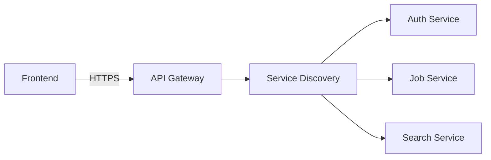
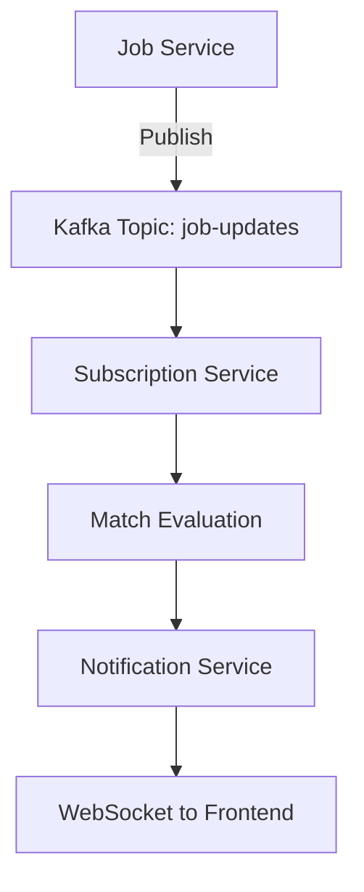

## Architecture Overview

SGJM Team is implementing the **Ultimo (Advanced)** architecture specification, featuring microservices backend, headless UI frontend, and event-driven communication.

## Target Architecture

<CardGroup cols={2}>
  <Card title="Frontend" icon="desktop">
    **Headless UI Architecture** - React with TanStack Query & Router - Zustand
    for state management - Shadcn/ui with Tailwind CSS - Reusable headless
    components
  </Card>
  <Card title="Backend" icon="server">
    **Microservices Architecture** - Spring Boot services - Bounded context per
    service - Database per service - Database sharding by Country
  </Card>
  <Card title="Messaging" icon="message">
    **Kafka Message Broker** - Real-time event streaming - Cross-subsystem
    communication - Pub/sub for notifications
  </Card>
  <Card title="Deployment" icon="docker">
    **Containerized Infrastructure** - Dockerized services - Service Discovery -
    API Gateway - Multi-host deployment
  </Card>
</CardGroup>

## Architecture Levels

### Simplex (Basic) - N-Tier Architecture

<Info>Foundation layer-based architecture separating concerns</Info>

**Layer Hierarchy (A.1.1, A.1.2):**

<Steps>
  <Step title="Presentation Layer">
    Controllers handling HTTP requests and responses
  </Step>
  <Step title="Business Logic Layer">
    Services implementing business rules and workflows
  </Step>
  <Step title="Repository Layer">
    Query definitions and execution (separate from DAO)
  </Step>
  <Step title="Data Access Layer">Database entities and mappings</Step>
</Steps>

**Additional Features (A.1.3):**

- Cookie Configuration
- Security Filters
- Token Generators
- Exception Handlers

### Medium - Modular Monolith Architecture

<Warning>Each module maintains strict bounded context</Warning>

**Module Structure (A.2.1, A.2.2):**

```
job-manager-backend/
├── auth-module/
│   ├── presentation/    # Controllers
│   ├── business/        # Services
│   ├── repository/      # Queries
│   └── domain/          # Entities
├── profile-module/
├── job-module/
├── search-module/
└── payment-module/
```

**API Organization (A.2.3, A.2.4, A.2.5):**

<Tabs>
  <Tab title="External APIs">
    **Public Services** exposed via interfaces - Available to other modules -
    Defined contracts - Versioned endpoints
  </Tab>
  <Tab title="Internal APIs">
    **Private Services** used within module - Not accessible to other modules -
    Implementation details hidden - Can change without affecting others
  </Tab>
</Tabs>

**Data Transfer (A.2.6):**

- External DTOs: Shared across modules
- Internal DTOs: Module-private only
- Minimize data exposure in responses

**Frontend Organization (A.2.a, A.2.b, A.2.c):**

```
job-manager-frontend/
├── components/
│   ├── common/           # Reusable UI elements
│   │   ├── Button/
│   │   ├── Input/
│   │   └── Card/
│   ├── auth/
│   │   ├── LoginForm/
│   │   │   ├── index.tsx       # Presentation
│   │   │   ├── hooks.ts        # Event handlers
│   │   │   ├── service.ts      # API calls
│   │   │   └── styles.css      # Styling
│   │   └── RegisterForm/
│   └── jobs/
└── utils/
    └── http-helper.ts    # REST HTTP Helper
```

### Ultimo - Microservices Architecture

<Card title="Advanced Distributed Architecture" icon="diagram-project">
  Fully distributed system with independent services, databases, and deployment
</Card>

**Microservices (A.3.1, A.3.2):**

<AccordionGroup>
  <Accordion title="Authentication Service">
    **Bounded Context:** User authentication and authorization
    - Company registration
    - Login/Logout
    - Token management (JWE)
    - SSO integration
    - Token revocation (Redis)

    **Database:** auth_db (User, Token, Session tables)

  </Accordion>

  <Accordion title="Profile Service">
    **Bounded Context:** Company profile management
    - Profile CRUD operations
    - Media uploads
    - Shard management

    **Database:** profile_db_shard_[country]

  </Accordion>

  <Accordion title="Job Service">
    **Bounded Context:** Job post management
    - Job CRUD operations
    - Skills tagging
    - Application tracking
    - Kafka publishing

    **Database:** job_db

  </Accordion>

  <Accordion title="Search Service">
    **Bounded Context:** Applicant search
    - Full-text search
    - Skill filtering
    - Shard-aware queries
    - Lazy loading

    **Database:** Read from applicant_db shards

  </Accordion>

  <Accordion title="Subscription Service">
    **Bounded Context:** Premium subscriptions
    - Subscription management
    - Search profile configuration
    - Match evaluation
    - Kafka consumption

    **Database:** subscription_db

  </Accordion>

  <Accordion title="Payment Service">
    **Bounded Context:** Payment processing
    - Stripe/PayPal integration
    - Transaction recording
    - Webhook handling

    **Database:** payment_db

  </Accordion>

  <Accordion title="Notification Service">
    **Bounded Context:** Real-time notifications
    - WebSocket connections
    - Kafka consumption
    - Email notifications

    **Database:** notification_db

  </Accordion>
</AccordionGroup>

**Database Sharding (A.3.3):**

<Info>Country used as sharding key for optimal query routing</Info>

```
Sharding Strategy:
- Shard 1: Vietnam companies & applicants
- Shard 2: Singapore companies & applicants
- Shard 3: Other countries

Search queries routed only to relevant shard(s)
```

**Transactions (A.3.4 - Bonus):**

```java
@Transactional
public void createJobPost(JobPostRequest request) {
    try {
        JobPost job = jobRepository.save(request.toEntity());
        skillRepository.saveAll(request.getSkills(), job.getId());
        kafkaProducer.publishJobCreated(job);
    } catch (Exception e) {
        // Transaction automatically rolled back
        throw new JobCreationException("Failed to create job", e);
    }
}
```

**Frontend - Headless UI (A.3.a):**

<AccordionGroup>
  <Accordion title="Headless Component Pattern">
    Separate logic from presentation for maximum reusability

    **Example: Data Table Component**

    ```typescript
    // Headless logic
    function useTable<T>(data: T[], columns: Column[]) {
      const [sortBy, setSortBy] = useState<string>();
      const [filterBy, setFilterBy] = useState<string>();

      const sortedData = useMemo(() => {
        // Sorting logic
      }, [data, sortBy]);

      const filteredData = useMemo(() => {
        // Filtering logic
      }, [sortedData, filterBy]);

      return { data: filteredData, sortBy, setSortBy, filterBy, setFilterBy };
    }

    // Usage in Job Posts
    <Table data={jobPosts} columns={jobColumns} />

    // Usage in Applications
    <Table data={applications} columns={applicationColumns} />
    ```

    **Shared Templates:**
    - Tables (job posts, applications, applicants)
    - Forms (login, registration, profile edit)
    - Modals (confirm delete, view details)
    - Cards (job card, applicant card, company card)
  </Accordion>
</AccordionGroup>

<Card title="Frontend Component Diagrams" icon="browser" href="/technical/frontend-components">
  View detailed C4 component diagrams for all 7 frontend feature modules, including Signup, Login, Dashboard, Profile, Subscription, Job Post, and Applicant Search.
</Card>

## System Context Diagram

The C4 System Context diagram provides a high-level view of the Job Manager system and its interactions with external actors and systems.

<Frame>
  
</Frame>

### Context Overview

<CardGroup cols={2}>
  <Card title="Primary Actors" icon="users">
    - **Company Recruiters** - Create and manage job posts
    - **Job Applicants** - Search and apply for jobs
    - **System Administrators** - Manage platform operations
  </Card>
  <Card title="External Systems" icon="arrow-right-arrow-left">
    - **Job Applicant (JA) System** - Candidate management subsystem
    - **Payment Gateway** - Stripe for premium subscriptions
    - **Identity Providers** - Google OAuth for SSO
    - **Email Service** - Mailgun for notifications
  </Card>
</CardGroup>

## Backend Container Diagram

The Job Manager backend follows a microservices architecture with clear separation of concerns. Each service has its own bounded context, database, and communicates via REST APIs and Kafka events.

<Frame>
  
</Frame>

### Container Overview

<CardGroup cols={2}>
  <Card title="Infrastructure Layer" icon="layer-group">
    - **API Gateway** (Spring Cloud Gateway)
    - **Service Discovery** (Eureka)
    - **Kafka Cluster** for event streaming
    - **Redis** for token caching
  </Card>
  <Card title="Core Microservices" icon="cubes">
    - Company Auth Service
    - Company Profile Service
    - Job Post Service
    - Payment Service
  </Card>
  <Card title="Supporting Services" icon="puzzle-piece">
    - Company Media Service
    - Notification Service
    - Applicant Discovery Service
    - Skill Tag Service
  </Card>
  <Card title="External Systems" icon="arrow-right-arrow-left">
    - Job Applicant (JA) Backend
    - External Payment Service (Stripe)
    - Google Authentication
    - Email Service (Mailgun)
    - Media File Storage (S3/GCS)
  </Card>
</CardGroup>

### Container Descriptions

<AccordionGroup>
  <Accordion title="API Gateway & Service Discovery">
    The **API Gateway** acts as the centralized entry point for the entire JM backend. Its responsibility is to accept incoming REST requests over HTTPS from the frontend system and route them to the appropriate microservices. It works in conjunction with **Service Discovery** (Eureka) to dynamically resolve the network locations of backend instances, ensuring that external clients interact with a stable interface regardless of internal infrastructure changes.
  </Accordion>

  <Accordion title="Company Authentication Service">
    Responsible for identity management and orchestration of company registration workflows. Upon receiving login requests via REST, it generates JWE tokens and interacts directly with the **Token Cache (Redis)** to store and validate access and refresh tokens. For new account creation, the service publishes an asynchronous event to the Company Profile Service to create the initial company record and waits for confirmation. It also manages subscription states by consuming payment confirmation events and integrates with external email services for subscription expiration alerts.

    **Kafka Topics:**
    - Publishes: `JM_SUBSCRIPTION_EXPIRED`, `JM_COMPANY_REGISTRATION`
    - Consumes: `JM_PROFILE_MATCHED`, `JM_SUBSCRIPTION_PAID`
  </Accordion>

  <Accordion title="Company Profile Service">
    Manages persistence and retrieval of core company information and "Applicant Marker" statuses. To handle data on a global scale, it connects to a cluster of **Company Profile database shards**, distributing data storage geographically. This service operates asynchronously to maintain data consistency; it consumes registration events from Company Auth Service to create initial records and listens for media update events from Company Media Service to automatically refresh logo URLs.

    **Database:** `profile_db_shard_[1-5]` (5 geographic shards)

    **Kafka Topics:**
    - Consumes: `JM_LOGO_UPDATED`, `JM_COMPANY_REGISTRATION`
  </Accordion>

  <Accordion title="Job Post Service">
    Acts as the central recruitment engine, handling the lifecycle of job advertisements and serving as the primary bridge to the JA Backend. When a manager views applications, this container sends an asynchronous retrieval request to the JA Backend and awaits a reply. Similarly, when application status changes, it synchronizes with the JA Backend. It also broadcasts real-time notification events to alert applicants when relevant job posts are created or updated.

    **Kafka Topics:**
    - Publishes: `JM_PROFILE_MATCHED`, `JM_JOB_POST_UPDATED`, `JM_APPLICATION_{ACTION}_REQUESTED`
    - Consumes: `JA_PROFILE_UPDATED`, `GET_JOBS_REQUESTED`, `ADMIN_{ACTION}_JOB_POST_REQUESTED`
  </Accordion>

  <Accordion title="Company Media Service">
    Handles upload and management of rich media assets (logos, images, videos). Instead of storing binaries internally, it interfaces directly with external media file storage (Google Cloud Storage) to upload files. Once a company's logo is successfully uploaded, it publishes an event to Company Profile Service to update the profile record with the new public URL.

    **Kafka Topics:**
    - Publishes: `JM_LOGO_UPDATED`
  </Accordion>

  <Accordion title="Applicant Discovery Service">
    Dedicated to processing search queries initiated by company managers. It accepts search filter parameters via REST and forwards queries to the JA Backend by publishing asynchronous search requests. It then waits for and consumes search results, aggregating data to return comprehensive result sets. Additionally, this service manages a dedicated **Discovery Database** to store and manage saved search profiles for premium users.

    **Kafka Topics:**
    - Publishes: `JM_APPLICANT_SEARCH_REQUESTED`
  </Accordion>

  <Accordion title="Payment Service">
    Isolates all financial transaction logic and acts as the secure interface for the **External Payment Service (Stripe)**. It processes premium subscription requests and, upon successful transaction, publishes events to Company Authentication Service to upgrade account status. It also supports the JA Backend by consuming applicant-side payment requests and sending back transaction results.

    **Kafka Topics:**
    - Publishes: `JM_SUBSCRIPTION_PAID`
    - Consumes: `PAYMENT_REQUESTED`
  </Accordion>

  <Accordion title="Notification Service">
    Aggregates system-wide events to generate real-time alerts for company managers. It monitors critical business events such as subscription expiration alerts from Company Auth Service. It also listens to applicant match events from Job Post Service to instantly notify managers when candidates fit their job criteria. For immediate delivery, it integrates with a dedicated **WebSocket System** to push notifications as events are processed.

    **Kafka Topics:**
    - Consumes: `JM_SUBSCRIPTION_EXPIRED`, `JM_APPLICANT_MATCHED`
  </Accordion>

  <Accordion title="Skill Tag Service">
    Maintains the centralized master list of technical skills and qualifications used to standardize data across the platform. It exposes REST APIs for the frontend to retrieve available tags, enabling consistent skill requirements when creating job posts. It handles lifecycle and persistence in its dedicated **Skill Tag Database** and serves as the source of truth for the external JA Backend, which makes direct REST calls to retrieve the standardized tag list.
  </Accordion>
</AccordionGroup>

### Database Sharding

Company Profile data is distributed across **5 geographic shards** based on population density:

| Shard | Region | Coverage |
|-------|--------|----------|
| Shard 1 | Africa | All African nations |
| Shard 2 | Europe | European nations |
| Shard 3 | Americas | North and South America |
| Shard 4 | East Asia | China and surrounding countries |
| Shard 5 | South/SE Asia & Pacific | India, ASEAN, Australia, Pacific |

<Card title="Backend Component Diagrams" icon="diagram-project" href="/technical/backend-components">
  View detailed C4 component diagrams for all 8 microservices, including Kafka topics, external integrations, and internal module structures.
</Card>

## Frontend Container Diagram

The Job Manager frontend is a Next.js application following a Headless UI architecture, separating business logic from presentation components.

<Frame>
  
</Frame>

### Frontend Architecture

<CardGroup cols={2}>
  <Card title="Core Framework" icon="react">
    - **Next.js** - React framework with SSR/SSG
    - **TanStack Query** - Server state management
    - **TanStack Router** - Type-safe routing
    - **Zustand** - Client state management
  </Card>
  <Card title="UI Layer" icon="palette">
    - **bamboo-ui** - Shared component library
    - **Shadcn/ui** - Headless UI primitives
    - **Tailwind CSS** - Utility-first styling
    - **Radix UI** - Accessible components
  </Card>
  <Card title="Feature Modules" icon="grid">
    - Authentication (Signup, Login)
    - Dashboard & Profile Management
    - Job Post Management
    - Applicant Search & Discovery
    - Subscription & Payment
  </Card>
  <Card title="Infrastructure" icon="gear">
    - **Fetcher Utilities** - API communication
    - **Constants Manager** - Configuration
    - **Validation Schemas** - Zod-based validation
    - **WebSocket Client** - Real-time notifications
  </Card>
</CardGroup>

## Communication Patterns

### Synchronous - REST API



### Asynchronous - Kafka



**Kafka Topics:**

<CardGroup cols={2}>
  <Card title="job-updates" icon="briefcase">
    Published when jobs are created/updated
  </Card>
  <Card title="applicant-profile-updates" icon="user">
    Published by Job Applicant system
  </Card>
  <Card title="match-notifications" icon="bell">
    Published when matches are found
  </Card>
  <Card title="payment-events" icon="credit-card">
    Published on payment success/failure
  </Card>
</CardGroup>

<Card title="System Flows Documentation" icon="arrows-split-up-and-left" href="/technical/system-flows">
  View detailed sequence diagrams for all system flows including Registration, Login, Profile Management, Job Posts, Applicant Search, and Premium Subscriptions with complete Kafka topic references.
</Card>

## Deployment Architecture

### Infrastructure Layout

<Tabs>
  <Tab title="Machine 1">
    **API Gateway + Service Discovery** - Kong or Spring Cloud Gateway - Eureka
    or Consul - Single logical host
  </Tab>
  <Tab title="Machine 2">
    **Kafka Cluster** - Kafka brokers - Zookeeper (if needed) - Isolated from
    other services
  </Tab>
  <Tab title="Machine 3">
    **Backend Services (Set 1)** - Auth Service - Profile Service - Job Service
  </Tab>
  <Tab title="Machine 4">
    **Backend Services (Set 2)** - Search Service - Subscription Service -
    Payment Service - Notification Service
  </Tab>
  <Tab title="Machine 5">
    **Frontend** - React application - Nginx server - Static assets
  </Tab>
</Tabs>

## Architecture Design Rationale

The following sections provide detailed justifications for our architectural decisions across key quality attributes, including advantages and trade-offs.

### Data Model Justification

<AccordionGroup>
  <Accordion title="Maintainability">
    **Advantages:**
    - By separating `CompanyAuth` (credentials) from `Company` (business details), we follow the Single Responsibility Principle. The Edit Profile feature only accesses the Company table, avoiding accidental changes to authentication logic stored in CompanyAuth.
    - The use of associative entities like `JobPost_SkillTag` instead of comma-separated strings ensures Third Normal Form (3NF) compliance.

    **Trade-offs:**
    - High normalization makes it harder to get a full view of a resource without complex JOIN operations. For example, displaying job post details requires joining JobPost, JobPost_SkillTag, SkillTag, and Company tables.
  </Accordion>

  <Accordion title="Extensibility">
    **Advantages:**
    - The `CompanyMedia` entity uses a MediaType Enum, making it easy to support new media formats (e.g., VR_TOUR, PDF_BROCHURE) by adding enum values.
    - The `SkillTag` entity serves as a separate dictionary that can be bulk-imported without modifying JobPost or Profile tables.

    **Trade-offs:**
    - The Bitmap data type for `employmentType` is efficient for storage and querying but difficult to extend with complex metadata. Database-level Enums require schema changes (DDL) to add new options.
  </Accordion>

  <Accordion title="Resilience">
    **Advantages:**
    - The `CompanyNotification` entity ensures data persistence. Unlike in-memory stores, saving notifications to the database prevents loss of critical alerts during service crashes.
    - UUID Primary Keys enable collision-free ID generation in distributed environments without a central ID generator.

    **Trade-offs:**
    - The JM system copies parts of Applicant profiles (SearchApplicantProfile) for the search feature. If synchronization fails, this data becomes stale, creating state consistency challenges.
  </Accordion>

  <Accordion title="Scalability">
    **Advantages:**
    - The Country entity as a partition key enables horizontal database sharding, preventing single-shard overload and maintaining performance across regions.

    **Trade-offs:**
    - Country-based sharding complicates global analytics. Getting total Job Posts globally requires querying every shard and combining results in the application layer.
  </Accordion>

  <Accordion title="Security">
    **Advantages:**
    - Storing `hashedPassword` and `ssoProvider` in the CompanyAuth table minimizes attack surface. Query injection vulnerabilities in public Company Search endpoints only expose profile data, not credentials.
    - The Transaction entity is managed by the Payment Service, keeping sensitive financial information separate from public profile views.

    **Trade-offs:**
    - Access Control Logic often requires ownership checks via joins across CompanyAuth, Company, and JobPost. Developers may be tempted to cache permissions unsafely under high load. The CompanyAuth table still contains email (PII), requiring strict encryption-at-rest.
  </Accordion>

  <Accordion title="Performance">
    **Advantages:**
    - The `employmentType` Bitmap enables direct bitwise AND/OR operations, making multi-status queries much faster than string comparisons or lookup table joins.
    - Storing `logoUrl` directly in the Company table (denormalization) prevents an extra JOIN query when displaying job cards.

    **Trade-offs:**
    - Normalized schema requires JOINs that can consume database CPU under high load when joining JobPost, Company, and SkillTags for every search result.
  </Accordion>
</AccordionGroup>

### Frontend Architecture Justification

<AccordionGroup>
  <Accordion title="Maintainability">
    **Advantages:**
    - The Headless UI pattern strictly separates logic, visuals, and business context. We can modify business logic (e.g., form submission states in HeadlessFormHook) without risking regression in the visual layer (HeadlessUIForm).
    - Pervasive use of TypeScript and Zod creates a self-documenting codebase with strictly defined data structures.

    **Trade-offs:**
    - High modularity results in fragmentation. A single feature like "Signin" spans multiple files (Page, Service, Schema, UI, Hook), potentially increasing cognitive load and file navigation for new developers.
  </Accordion>

  <Accordion title="Extensibility">
    **Advantages:**
    - The composition model allows high-level pages to assemble reusable feature components. Adding "Microsoft SSO" requires only reusing existing HeadlessButton and HeadlessButtonHook with new branding parameters.
    - Expanding taxonomy (e.g., adding "Remote vs. On-site" filter) is immediate via generic HeadlessSelect and HeadlessTagInput components.

    **Trade-offs:**
    - Abstraction leaks may occur if future requirements demand specific UI behavior the base HeadlessHook doesn't support, potentially requiring base hook refactoring and regression testing.
  </Accordion>

  <Accordion title="Resilience">
    **Advantages:**
    - Centralized Fetcher Utilities ensure network failures are caught and handled gracefully in a single location, preventing cascading failures.
    - ValidateSchema components prevent invalid inputs from triggering network requests, protecting the backend from bad data.

    **Trade-offs:**
    - Heavy reliance on client-side execution means validation and error handling may fail if users' devices block scripts or fail to parse the JavaScript bundle.
  </Accordion>

  <Accordion title="Scalability">
    **Advantages:**
    - The reusable bamboo-ui library and modular feature components ensure JavaScript bundle size grows slowly as features expand.
    - Modularity enables parallel development across team members without merge conflicts.

    **Trade-offs:**
    - Feature complexity can lead to "prop drilling" issues without global state management solutions like Zustand or Redux.
  </Accordion>

  <Accordion title="Security">
    **Advantages:**
    - Zod schemas for forms intercept potentially malicious scripts or SQL injection attempts at the browser level.
    - The Fetcher Utility automatically handles JWE/JWS header attachment, preventing accidental token exposure.

    **Trade-offs:**
    - Frontend validation provides only a first line of defense. Client-side restrictions can be bypassed with tools like Postman; the backend must rigorously re-validate all incoming data.
  </Accordion>

  <Accordion title="Performance">
    **Advantages:**
    - Headless UI maximizes rendering efficiency using standard HTML elements with minimal state logic.
    - TailwindCSS ensures minimal CSS bundles by purging unused styles.
    - Optimistic UI patterns improve perceived speed (e.g., instantly removing a deleted Job Post while the API request processes).

    **Trade-offs:**
    - Rich interactivity incurs hydration costs. Users on slow connections may experience a brief "uncanny valley" where buttons are visible but not yet clickable.
  </Accordion>
</AccordionGroup>

### Backend Architecture Justification

<AccordionGroup>
  <Accordion title="Maintainability">
    **Advantages:**
    - Standardized Layered Architecture (Controller - Service - Repository) within each microservice allows developers to isolate business logic from data access code.
    - Contract Stability via distinct Internal and External DTOs ensures refactoring internal schemas doesn't break consumer code.
    - Bounded Contexts allow independent maintenance and deployment of specific functionalities.

    **Trade-offs:**
    - Distributed design introduces debugging complexity. Tracking failed requests requires correlating logs across API Gateway, microservices, and Kafka broker.
  </Accordion>

  <Accordion title="Extensibility">
    **Advantages:**
    - Event-Driven Integration via Kafka allows adding new features (e.g., Analytics Service) by adding consumers to existing topics without modifying source services.
    - Dynamic Discovery via Eureka ensures new service instances are automatically registered without manual configuration.

    **Trade-offs:**
    - Avro schema reliance requires strict schema evolution management. Modifying event structures without backward compatibility risks breaking downstream consumers.
    - Granular architecture means even small features require multiple files across layers and Kafka topic configuration.
  </Accordion>

  <Accordion title="Resilience">
    **Advantages:**
    - **Fault Isolation:** Each domain runs in its own container with dedicated resources. If the Notification Service crashes, core flows (Authentication, Job Posting) remain unaffected. In a monolith, any module issue would crash the entire application.
    - **Asynchronous Buffering:** Kafka serves as a durability buffer. If the JA Backend goes offline, events queue in Kafka and process automatically upon recovery.

    **Trade-offs:**
    - Infrastructure dependency introduces single points of failure. Platform functionality depends on API Gateway and Kafka Cluster uptime.
    - Asynchronous operations mean eventual consistency; data may be temporarily out of sync between services.
  </Accordion>

  <Accordion title="Scalability">
    **Advantages:**
    - **Geo-Sharding:** Company Profile Database is sharded across five geographic regions, distributing write load across nodes.
    - **Media Offloading:** Google Cloud Storage handles large binary files, keeping application servers lightweight.

    **Trade-offs:**
    - Sharding complicates global queries. Reports requiring all five shards need expensive in-memory aggregation.
    - Running dedicated containers for Gateway, Discovery, Config, Kafka, and five database shards requires significant baseline resources.
  </Accordion>

  <Accordion title="Security">
    **Advantages:**
    - **Real-Time Token Revocation:** Redis cache stores JWE token revocation status. Unlike stateless JWTs, we can maintain a "Blocklist" for immediate session termination on logout, password change, or account compromise.
    - **Domain Isolation:** Separate Authentication Services for JA and JM systems provide security boundaries. A DDoS attack on the public-facing Applicant side doesn't compromise Manager operations.

    **Trade-offs:**
    - Access/Refresh token flow increases frontend complexity. The client must intercept 401 responses, pause requests, exchange refresh tokens, and retry original requests.
  </Accordion>

  <Accordion title="Performance">
    **Advantages:**
    - **Non-Blocking Operations:** Asynchronous processing via Kafka allows APIs to return immediate responses while heavy tasks process in the background.
    - **High-Speed Session Access:** Redis in-memory cache ensures sub-millisecond latency for session validation on every request.

    **Trade-offs:**
    - Microservices introduce network latency. Single requests may traverse Gateway, Auth Service, and Business Service, adding latency compared to monolithic in-memory calls.
    - Continuous JSON (REST) and Avro (Kafka) serialization consumes CPU cycles, impacting throughput under extreme loads.
  </Accordion>
</AccordionGroup>

## Design Quality Summary

<CardGroup cols={3}>
  <Card title="Maintainability" icon="wrench">
    - Clear bounded contexts per service
    - Consistent REST conventions
    - Typed DTOs and interfaces
    - Standardized layering
  </Card>
  <Card title="Extensibility" icon="puzzle-piece">
    - Event-driven additions via Kafka
    - Dynamic service discovery
    - Plugin architecture for payments
    - Backward-compatible APIs
  </Card>
  <Card title="Resilience" icon="shield">
    - Circuit breakers (Resilience4j)
    - Fault isolation per service
    - Async buffering via Kafka
    - Health checks per service
  </Card>
  <Card title="Scalability" icon="arrows-up-down">
    - Horizontal scaling per service
    - Database sharding (5 regions)
    - Redis caching
    - Media offloading to GCS
  </Card>
  <Card title="Security" icon="lock">
    - JWE encrypted tokens
    - Token revocation in Redis
    - Domain isolation
    - Input validation (FE + BE)
  </Card>
  <Card title="Performance" icon="bolt">
    - Full-text search indexes
    - Shard-aware queries
    - Lazy loading and pagination
    - Non-blocking operations
  </Card>
</CardGroup>

## Technology Stack

<Tabs>
  <Tab title="Frontend">
    - **Framework:** React 18 - **Routing:** TanStack Router - **Data
    Fetching:** TanStack Query - **State:** Zustand - **UI:** Shadcn/ui +
    Tailwind CSS - **HTTP:** Axios
  </Tab>
  <Tab title="Backend">
    - **Framework:** Spring Boot 3.x - **Database:** PostgreSQL (primary),
    MongoDB (documents) - **Cache:** Redis - **Messaging:** Apache Kafka -
    **Security:** Spring Security + JWT - **API Docs:** SpringDoc OpenAPI
  </Tab>
  <Tab title="DevOps">
    - **Containers:** Docker - **Orchestration:** Kubernetes (bonus) -
    **Gateway:** Kong or Spring Cloud Gateway - **Discovery:** Eureka -
    **CI/CD:** GitHub Actions
  </Tab>
</Tabs>

## Related Documentation

- [Data Model](/technical/data-model)
- [Deployment](/technical/deployment)
- [API Reference](/api-reference/introduction)
