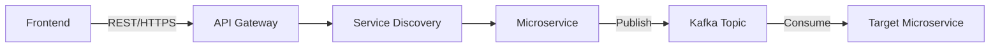

## Overview

The Job Manager backend is decomposed into 8 microservices, each with a dedicated bounded context. This page provides detailed C4 component diagrams for each service.

<Info>
  All microservices follow a consistent internal architecture with **API Module** (interfaces, DTOs) and **Service Module** (business logic, repositories).
</Info>

## Container Diagram

The complete backend container diagram showing all microservices, databases, Kafka messaging, and external system integrations.

<Frame>
  
</Frame>

### System Components

<CardGroup cols={2}>
  <Card title="Infrastructure Layer" icon="layer-group">
    - **API Gateway** (Spring Cloud Gateway)
    - **Service Discovery** (Eureka)
    - **Kafka Cluster** for event streaming
    - **Redis** for token caching
  </Card>
  <Card title="Core Microservices" icon="cubes">
    - Company Auth Service
    - Company Profile Service
    - Job Post Service
    - Payment Service
  </Card>
  <Card title="Supporting Services" icon="puzzle-piece">
    - Company Media Service
    - Notification Service
    - Applicant Discovery Service
    - Skill Tag Service
  </Card>
  <Card title="External Systems" icon="arrow-right-arrow-left">
    - Job Applicant (JA) Backend
    - External Payment Service (Stripe)
    - Google Authentication
    - Email Service (Mailgun)
    - Media File Storage (S3/GCS)
  </Card>
</CardGroup>

## Common Components

All microservices share these foundational architectural elements:

<AccordionGroup>
  <Accordion title="Filter & Security Component">
    Spring Boot security filter that validates all incoming requests originate from the API Gateway, preventing unauthorized direct access to internal services. This filter intercepts every incoming request to verify it originated from our API Gateway, maintaining the secured connection of our internal network and preventing outer requests.

    ```java
    @Component
    public class GatewayOriginFilter extends OncePerRequestFilter {
        @Override
        protected void doFilterInternal(HttpServletRequest request,
                                        HttpServletResponse response,
                                        FilterChain chain) {
            String gatewayHeader = request.getHeader("X-Gateway-Origin");
            if (isValidGatewayOrigin(gatewayHeader)) {
                chain.doFilter(request, response);
            } else {
                response.sendError(HttpStatus.FORBIDDEN.value());
            }
        }
    }
    ```
  </Accordion>

  <Accordion title="API Module Structure">
    Encapsulates **External** elements (exposed interfaces/DTOs) and **Internal** elements (module-private). Only External elements are exposed to other modules and microservices while Internal data remains isolated. This enforces strict encapsulation and the Separation of Concerns principle.

    ```
    api-module/
    ├── external/
    │   ├── Interface.java      # Public API contract
    │   └── DTO.java            # External data transfer
    └── internal/
        ├── Interface.java      # Private API contract
        └── DTO.java            # Internal data transfer
    ```
  </Accordion>

  <Accordion title="Service Module Structure">
    Contains `@Service` components for business logic and `@Repository` components for database operations. The Service module contains the core business logic of the microservice, ensuring modular architecture and ease of maintenance.

    ```
    service-module/
    ├── Controller.java         # REST endpoints
    ├── Service.java            # Business logic
    ├── Repository.java         # Database queries
    └── Model.java              # Entity definitions
    ```
  </Accordion>

  <Accordion title="Kafka Configuration">
    Defines producer/consumer configurations with topics and Avro schemas for event messaging.

    **Request-Reply Pattern:**
    Every Kafka communication follows the Request-Reply pattern which includes two Kafka topics:
    - A **Publisher topic** to trigger the request process
    - A **Consumer topic** to get the reply result (follows pattern `{TOPIC}_REPLIED`)

    ```java
    @Configuration
    public class KafkaConfig {
        @Bean
        public ProducerFactory<String, Object> producerFactory() {
            Map<String, Object> props = new HashMap<>();
            props.put(ProducerConfig.KEY_SERIALIZER_CLASS_CONFIG, StringSerializer.class);
            props.put(ProducerConfig.VALUE_SERIALIZER_CLASS_CONFIG, KafkaAvroSerializer.class);
            return new DefaultKafkaProducerFactory<>(props);
        }
    }
    ```
  </Accordion>

  <Accordion title="Redis Configuration">
    Exclusively implemented within the Auth Microservice to handle seamless authentication access. Redis is used as an in-memory storage to cache `auth_token` and `refresh_token` for authenticated users, significantly reducing latency during token validation by skipping queries to the primary database.

    ```java
    @Configuration
    public class RedisConfig {
        @Bean
        public RedisTemplate<String, Object> redisTemplate(RedisConnectionFactory factory) {
            RedisTemplate<String, Object> template = new RedisTemplate<>();
            template.setConnectionFactory(factory);
            template.setKeySerializer(new StringRedisSerializer());
            template.setValueSerializer(new GenericJackson2JsonRedisSerializer());
            return template;
        }
    }
    ```
  </Accordion>
</AccordionGroup>

### Kafka Communication Convention

All frontend communication requests are directed to the API Gateway. The frontend does not communicate directly with microservices. Instead, it sends RESTful requests to the Gateway, which then verifies, identifies, and routes these requests to the corresponding microservice.



---

## Company Authentication Service

Handles company registration, login, SSO integration, and premium subscription status management.

<Frame>
  
</Frame>

### Communication

<Tabs>
  <Tab title="Incoming Events">
    | Source | Topic | Purpose |
    |--------|-------|---------|
    | JA Backend | `JA_PROFILE_MATCHED` | New/updated applicants matching job posts |
    | Payment Service | `JM_SUBSCRIPTION_PAID` | Update premium status after payment |
  </Tab>
  <Tab title="Outgoing Events">
    | Target | Topic | Purpose |
    |--------|-------|---------|
    | Notification Service | `JM_SUBSCRIPTION_EXPIRED` | Trigger expiration notifications |
    | Notification Service | `JM_APPLICANT_MATCHED` | Notify premium companies of matches |
  </Tab>
  <Tab title="External Services">
    - **Google Authentication** - OAuth 2.0 for SSO login
    - **Mailgun Email API** - Subscription expiration emails
    - **Redis Token Cache** - Store/validate access and refresh tokens
  </Tab>
</Tabs>

### Key Components

| Component | Responsibility |
|-----------|---------------|
| Company Auth Controller | REST endpoints for login, register, logout |
| Company Auth Service | Authentication business logic |
| Company Auth Repository | User credential persistence |
| Redis Config | Token cache configuration |
| Kafka Config | Event publishing/consumption |

---

## Company Profile Service

Manages company profile CRUD operations with geographic database sharding.

<Frame>
  
</Frame>

### Communication

<Tabs>
  <Tab title="Incoming Events">
    | Source | Topic | Purpose |
    |--------|-------|---------|
    | Company Media Service | `JM_LOGO_UPDATED` | Update logoUrl in profile |
    | Company Auth Service | `JM_COMPANY_REGISTRATION` | Create new profile record |
  </Tab>
  <Tab title="Database Sharding">
    Connects to multiple profile database shards based on company country:

    | Shard | Region |
    |-------|--------|
    | Shard 1 | Africa |
    | Shard 2 | Europe |
    | Shard 3 | Americas |
    | Shard 4 | East Asia |
    | Shard 5 | South/SE Asia & Pacific |
  </Tab>
</Tabs>

### Key Components

| Component | Responsibility |
|-----------|---------------|
| Company Profile Controller | REST endpoints for profile CRUD |
| Company Profile Service | Profile business logic |
| Company Profile Repository | Shard-aware data persistence |
| Kafka Config | Event consumption for updates |

---

## Job Post Service

Core recruitment engine handling job lifecycle and JA Backend integration.

<Frame>
  
</Frame>

### Communication

<Tabs>
  <Tab title="Incoming Events">
    | Source | Topic | Purpose |
    |--------|-------|---------|
    | JA Backend | `JA_PROFILE_UPDATED` | Trigger premium notifications |
    | JA Backend | `GET_JOBS_REQUESTED` | Job filtering for JA searches |
    | JA Backend | `ADMIN_{ACTION}_JOB_POST_REQUESTED` | Admin CRUD operations |
  </Tab>
  <Tab title="Outgoing Events">
    | Target | Topic | Purpose |
    |--------|-------|---------|
    | Auth Service | `JM_PROFILE_MATCHED` | Matching company IDs for notifications |
    | JA Backend | `JM_JOB_POST_UPDATED` | Notify premium applicants |
    | JA Backend | `JM_APPLICATION_{ACTION}_REQUESTED` | Get/update application info |
  </Tab>
</Tabs>

### Key Components

| Component | Responsibility |
|-----------|---------------|
| Job Post Controller | REST endpoints for job CRUD |
| Job Post Service | Job lifecycle business logic |
| Job Post Repository | Job data persistence |
| Job Post Model | Job entity with skill tags |
| Kafka Config | Cross-system event messaging |

---

## Payment Service

Handles premium subscription payments via Stripe integration.

<Frame>
  
</Frame>

### Communication

<Tabs>
  <Tab title="Incoming Events">
    | Source | Topic | Purpose |
    |--------|-------|---------|
    | JA Backend | `PAYMENT_REQUESTED` | Premium subscription from applicants |
  </Tab>
  <Tab title="Outgoing Events">
    | Target | Topic | Purpose |
    |--------|-------|---------|
    | Company Auth Service | `JM_SUBSCRIPTION_PAID` | Update premium status |
  </Tab>
  <Tab title="External Services">
    - **Stripe** - Third-party payment processing
    - **Transaction Database** - Financial audit trail
  </Tab>
</Tabs>

### Key Components

| Component | Responsibility |
|-----------|---------------|
| Payment Controller | REST endpoints for payment initiation |
| Payment Service | Payment processing business logic |
| Payment Repository | Transaction record persistence |
| Payment Model | Transaction entity |
| Kafka Config | Payment event messaging |

---

## Company Media Service

Manages media file uploads (logos, images, videos) with cloud storage.

<Frame>
  
</Frame>

### Communication

<Tabs>
  <Tab title="Outgoing Events">
    | Target | Topic | Purpose |
    |--------|-------|---------|
    | Company Profile Service | `JM_LOGO_UPDATED` | Update logo URL in profile |
  </Tab>
  <Tab title="External Services">
    - **AWS S3 / Google Cloud Storage** - Media file storage
    - Supports `IMAGE` and `VIDEO` media types
  </Tab>
</Tabs>

### Key Components

| Component | Responsibility |
|-----------|---------------|
| Company Media Controller | REST endpoints for media CRUD |
| Company Media Service | File upload business logic |
| Company Media Repository | Media metadata persistence |
| Company Media Model | Media entity with type enum |
| Kafka Config | Logo update event publishing |

---

## Notification Service

Processes notification events and delivers real-time alerts via WebSocket.

<Frame>
  
</Frame>

### Communication

<Tabs>
  <Tab title="Incoming Events">
    | Source | Topic | Purpose |
    |--------|-------|---------|
    | Auth Service | `JM_SUBSCRIPTION_EXPIRED` | Expired subscription alerts |
    | Job Post Service | `JM_APPLICANT_MATCHED` | New applicant match alerts |
  </Tab>
  <Tab title="Delivery Channels">
    - **WebSocket** - Real-time push notifications to frontend
    - **Notification Database** - Persist for offline users
    - Manages `isRead` status for UI indicators
  </Tab>
</Tabs>

### Key Components

| Component | Responsibility |
|-----------|---------------|
| Notification Controller | REST endpoints for notification retrieval |
| Notification Service | Alert processing business logic |
| Notification Repository | Notification persistence |
| Notification Model | Notification entity with read status |
| WebSocket | Real-time delivery system |
| Kafka Config | Event consumption |

---

## Applicant Discovery Service

Handles premium company search profiles and applicant search requests.

<Frame>
  
</Frame>

### Communication

<Tabs>
  <Tab title="REST APIs">
    - Search Profile CRUD for premium companies
    - Applicant search requests with filters
    - Full-text search across applicant profiles
  </Tab>
  <Tab title="Outgoing Events">
    | Target | Topic | Purpose |
    |--------|-------|---------|
    | JA Backend | `JM_APPLICANT_SEARCH_REQUESTED` | Get applicant data for Full-Text Search |
  </Tab>
</Tabs>

### Key Components

| Component | Responsibility |
|-----------|---------------|
| Applicant Discovery Controller | REST endpoints for search |
| Applicant Discovery Service | Search orchestration logic |
| Applicant Discovery Repository | Search profile persistence |
| Applicant Discovery Model | Search profile entity |
| Kafka Config | Cross-system search requests |

---

## Skill Tag Service

Maintains the centralized master list of technical skills shared across the platform.

<Frame>
  
</Frame>

<Info>
  The Skill Tag Service is the **source of truth** for skill taxonomy. Both JM and JA backends retrieve tags via REST API to ensure consistent skill matching.
</Info>

### Key Responsibilities

- CRUD operations for skill tags
- Provide autocomplete suggestions for job posts
- Ensure unified taxonomy across job posts and applicant profiles
- Expose REST API for JA Backend consumption

### Key Components

| Component | Responsibility |
|-----------|---------------|
| Skill Tag Controller | REST endpoints for tag CRUD |
| Skill Tag Service | Tag management business logic |
| Skill Tag Repository | Tag data persistence |
| Skill Tag Model | Tag entity |

---

## Related Documentation

- [System Architecture](/technical/architecture)
- [Data Model](/technical/data-model)
- [Deployment](/technical/deployment)
