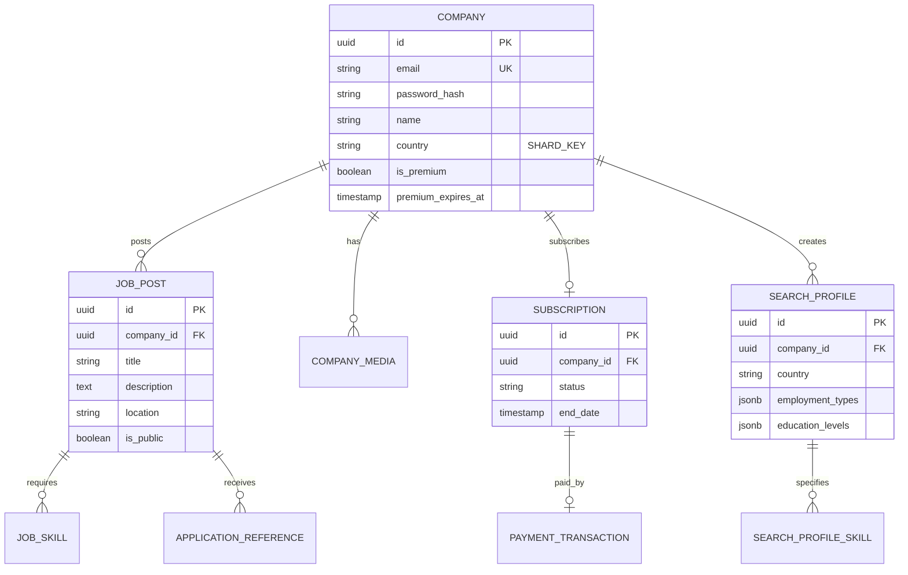

## Overview

The data model for the Job Manager subsystem is designed to support all functional requirements while maintaining data integrity, scalability, and performance through database sharding.

## Sharding Strategy

<Card title="Sharding Key: Country" icon="database">
User and company data is partitioned across database shards based on the **Country** field to:
- Optimize location-based searches
- Improve query performance
- Enable geographic data distribution
- Facilitate compliance with data residency requirements
</Card>

**Shard Distribution:**
- **Shard 1:** Vietnam
- **Shard 2:** Singapore
- **Shard 3:** Other countries

## Core Entities

### Company Entity

<AccordionGroup>
  <Accordion title="Company Table Schema">
    ```sql
    CREATE TABLE companies (
        id UUID PRIMARY KEY DEFAULT gen_random_uuid(),
        email VARCHAR(255) UNIQUE NOT NULL,
        password_hash VARCHAR(255), -- NULL for SSO users
        name VARCHAR(255) NOT NULL,

        -- Contact Information
        phone VARCHAR(20),
        street VARCHAR(255),
        city VARCHAR(100),
        country VARCHAR(100) NOT NULL, -- SHARDING KEY

        -- Authentication
        sso_provider VARCHAR(50), -- GOOGLE, MICROSOFT, FACEBOOK, GITHUB
        sso_user_id VARCHAR(255),
        is_activated BOOLEAN DEFAULT FALSE,
        activation_token VARCHAR(255),

        -- Profile
        about_us TEXT,
        who_we_are_looking_for TEXT,
        logo_url VARCHAR(500),

        -- Premium
        is_premium BOOLEAN DEFAULT FALSE,
        premium_expires_at TIMESTAMP,

        -- Audit
        created_at TIMESTAMP DEFAULT NOW(),
        updated_at TIMESTAMP DEFAULT NOW(),
        last_login_at TIMESTAMP,

        -- Indexes
        INDEX idx_email (email),
        INDEX idx_country (country),
        INDEX idx_premium (is_premium, premium_expires_at),
        INDEX idx_sso (sso_provider, sso_user_id)
    );
    ```

    **Relationships:**
    - One-to-Many with JobPosts
    - One-to-Many with SearchProfiles
    - One-to-One with Subscription
    - One-to-Many with CompanyMedia
  </Accordion>

  <Accordion title="Company Media Table">
    ```sql
    CREATE TABLE company_media (
        id UUID PRIMARY KEY DEFAULT gen_random_uuid(),
        company_id UUID NOT NULL REFERENCES companies(id) ON DELETE CASCADE,

        media_type VARCHAR(20) NOT NULL, -- IMAGE, VIDEO
        media_url VARCHAR(500) NOT NULL,
        title VARCHAR(255),
        display_order INT DEFAULT 0,

        created_at TIMESTAMP DEFAULT NOW(),

        INDEX idx_company (company_id),
        INDEX idx_type (company_id, media_type)
    );
    ```
  </Accordion>
</AccordionGroup>

### Job Post Entity

<AccordionGroup>
  <Accordion title="Job Posts Table">
    ```sql
    CREATE TABLE job_posts (
        id UUID PRIMARY KEY DEFAULT gen_random_uuid(),
        company_id UUID NOT NULL REFERENCES companies(id) ON DELETE CASCADE,

        -- Basic Information
        title VARCHAR(255) NOT NULL,
        description TEXT NOT NULL,
        location VARCHAR(255) NOT NULL,

        -- Employment
        is_full_time BOOLEAN DEFAULT FALSE,
        is_part_time BOOLEAN DEFAULT FALSE,
        is_internship BOOLEAN DEFAULT FALSE,
        is_contract BOOLEAN DEFAULT FALSE,

        -- Salary
        salary_type VARCHAR(20) NOT NULL, -- RANGE, ESTIMATION, NEGOTIABLE
        salary_min DECIMAL(10,2),
        salary_max DECIMAL(10,2),
        salary_currency VARCHAR(3) DEFAULT 'USD',
        salary_text VARCHAR(255), -- "About 1000", "Up to 2000"

        -- Dates
        posted_date TIMESTAMP DEFAULT NOW(),
        expiry_date TIMESTAMP,

        -- Status
        is_public BOOLEAN DEFAULT FALSE,

        created_at TIMESTAMP DEFAULT NOW(),
        updated_at TIMESTAMP DEFAULT NOW(),

        INDEX idx_company (company_id),
        INDEX idx_public (is_public, posted_date DESC),
        INDEX idx_expiry (expiry_date),
        FULLTEXT idx_search (title, description)
    );
    ```
  </Accordion>

  <Accordion title="Job Skills Table">
    ```sql
    CREATE TABLE job_skills (
        id UUID PRIMARY KEY DEFAULT gen_random_uuid(),
        job_post_id UUID NOT NULL REFERENCES job_posts(id) ON DELETE CASCADE,
        skill_name VARCHAR(100) NOT NULL,

        created_at TIMESTAMP DEFAULT NOW(),

        INDEX idx_job (job_post_id),
        INDEX idx_skill (skill_name),
        INDEX idx_job_skill (job_post_id, skill_name),

        UNIQUE(job_post_id, skill_name)
    );
    ```
  </Accordion>
</AccordionGroup>

### Application Tracking

<Info>
Application data is primarily managed by Job Applicant subsystem. Job Manager maintains references and status.
</Info>

```sql
CREATE TABLE application_references (
    id UUID PRIMARY KEY DEFAULT gen_random_uuid(),
    job_post_id UUID NOT NULL REFERENCES job_posts(id) ON DELETE CASCADE,
    applicant_id UUID NOT NULL, -- Reference to JA subsystem

    -- Status tracking
    status VARCHAR(20) DEFAULT 'PENDING', -- PENDING, ARCHIVED

    -- Company notes (internal only)
    notes TEXT,

    -- Marking
    is_favorite BOOLEAN DEFAULT FALSE,
    is_warning BOOLEAN DEFAULT FALSE,

    applied_at TIMESTAMP,
    archived_at TIMESTAMP,

    created_at TIMESTAMP DEFAULT NOW(),
    updated_at TIMESTAMP DEFAULT NOW(),

    INDEX idx_job (job_post_id, status),
    INDEX idx_applicant (applicant_id),
    INDEX idx_status (status),
    INDEX idx_favorite (is_favorite),
    INDEX idx_warning (is_warning),

    UNIQUE(job_post_id, applicant_id)
);
```

### Subscription & Premium

<AccordionGroup>
  <Accordion title="Subscriptions Table">
    ```sql
    CREATE TABLE subscriptions (
        id UUID PRIMARY KEY DEFAULT gen_random_uuid(),
        company_id UUID NOT NULL REFERENCES companies(id) ON DELETE CASCADE,

        -- Subscription details
        status VARCHAR(20) NOT NULL, -- ACTIVE, EXPIRED, CANCELLED
        start_date TIMESTAMP NOT NULL,
        end_date TIMESTAMP NOT NULL,

        -- Payment reference
        payment_transaction_id UUID,

        -- Notifications
        seven_day_warning_sent BOOLEAN DEFAULT FALSE,
        expiry_notice_sent BOOLEAN DEFAULT FALSE,

        created_at TIMESTAMP DEFAULT NOW(),
        updated_at TIMESTAMP DEFAULT NOW(),

        INDEX idx_company (company_id),
        INDEX idx_status (status),
        INDEX idx_expiry (end_date),
        INDEX idx_notifications (end_date, seven_day_warning_sent, expiry_notice_sent)
    );
    ```
  </Accordion>

  <Accordion title="Search Profiles Table">
    ```sql
    CREATE TABLE search_profiles (
        id UUID PRIMARY KEY DEFAULT gen_random_uuid(),
        company_id UUID NOT NULL REFERENCES companies(id) ON DELETE CASCADE,

        profile_name VARCHAR(255) NOT NULL,

        -- Search criteria
        country VARCHAR(100),
        min_salary DECIMAL(10,2),
        max_salary DECIMAL(10,2),

        -- Employment preferences (JSON array)
        employment_types JSONB, -- ["FULL_TIME", "INTERNSHIP"]

        -- Education requirements (JSON array)
        education_levels JSONB, -- ["BACHELOR", "MASTER"]

        is_active BOOLEAN DEFAULT TRUE,

        created_at TIMESTAMP DEFAULT NOW(),
        updated_at TIMESTAMP DEFAULT NOW(),

        INDEX idx_company (company_id),
        INDEX idx_active (is_active),
        INDEX idx_country (country)
    );
    ```
  </Accordion>

  <Accordion title="Search Profile Skills Table">
    ```sql
    CREATE TABLE search_profile_skills (
        id UUID PRIMARY KEY DEFAULT gen_random_uuid(),
        search_profile_id UUID NOT NULL REFERENCES search_profiles(id) ON DELETE CASCADE,
        skill_name VARCHAR(100) NOT NULL,

        created_at TIMESTAMP DEFAULT NOW(),

        INDEX idx_profile (search_profile_id),
        INDEX idx_skill (skill_name),

        UNIQUE(search_profile_id, skill_name)
    );
    ```
  </Accordion>
</AccordionGroup>

### Payment Transactions

```sql
CREATE TABLE payment_transactions (
    id UUID PRIMARY KEY DEFAULT gen_random_uuid(),

    -- User reference
    user_type VARCHAR(20) NOT NULL, -- COMPANY or APPLICANT
    user_id UUID NOT NULL,
    user_email VARCHAR(255) NOT NULL,

    -- Payment details
    amount DECIMAL(10,2) NOT NULL,
    currency VARCHAR(3) DEFAULT 'USD',

    -- Status
    status VARCHAR(20) NOT NULL, -- SUCCESS, PENDING, FAILED, REFUNDED, CANCELLED
    payment_method VARCHAR(50) NOT NULL, -- STRIPE, PAYPAL
    payment_provider VARCHAR(50) NOT NULL,

    -- Provider data
    provider_transaction_id VARCHAR(255) UNIQUE,
    provider_customer_id VARCHAR(255),

    -- Subscription dates
    subscription_start_date TIMESTAMP,
    subscription_end_date TIMESTAMP,

    -- Metadata
    metadata JSONB,

    created_at TIMESTAMP DEFAULT NOW(),
    updated_at TIMESTAMP DEFAULT NOW(),

    INDEX idx_user (user_id, user_type),
    INDEX idx_email (user_email),
    INDEX idx_status (status),
    INDEX idx_provider (provider_transaction_id),
    INDEX idx_created (created_at DESC)
);
```

### Authentication

```sql
CREATE TABLE token_revocations (
    id UUID PRIMARY KEY DEFAULT gen_random_uuid(),
    company_id UUID NOT NULL,
    token_jti VARCHAR(255) UNIQUE NOT NULL, -- JWT ID

    revoked_at TIMESTAMP DEFAULT NOW(),
    expires_at TIMESTAMP NOT NULL,

    INDEX idx_jti (token_jti),
    INDEX idx_company (company_id),
    INDEX idx_expires (expires_at)
);

CREATE TABLE login_attempts (
    id UUID PRIMARY KEY DEFAULT gen_random_uuid(),
    email VARCHAR(255) NOT NULL,

    success BOOLEAN NOT NULL,
    ip_address VARCHAR(45),
    user_agent TEXT,

    attempted_at TIMESTAMP DEFAULT NOW(),

    INDEX idx_email_time (email, attempted_at DESC),
    INDEX idx_attempted (attempted_at)
);
```

## Entity Relationship Diagram



## Data Migration Strategy

### Shard Migration

When a company changes their country (sharding key):

<Steps>
  <Step title="Identify Target Shard">
    Determine new shard based on new country value
  </Step>
  <Step title="Begin Transaction">
    Start distributed transaction across shards
  </Step>
  <Step title="Copy Data">
    Copy all company data to new shard
  </Step>
  <Step title="Verify Integrity">
    Ensure all data copied correctly
  </Step>
  <Step title="Update Routing">
    Update routing table with new shard mapping
  </Step>
  <Step title="Delete Old Data">
    Remove data from old shard
  </Step>
  <Step title="Commit Transaction">
    Finalize migration
  </Step>
</Steps>

## Design Justifications

### Advantages

<AccordionGroup>
  <Accordion title="Scalability">
    - Horizontal sharding by country enables geographic distribution
    - Independent scaling of each shard
    - Reduced query load per database
  </Accordion>

  <Accordion title="Performance">
    - Location-based queries hit only relevant shard
    - Full-text search indexes on job posts
    - Compound indexes for common query patterns
  </Accordion>

  <Accordion title="Maintainability">
    - Clear entity boundaries
    - Normalized schema reduces redundancy
    - Consistent naming conventions
  </Accordion>

  <Accordion title="Security">
    - Password hashing for non-SSO users
    - Token revocation tracking
    - Audit trails with timestamps
  </Accordion>
</AccordionGroup>

### Limitations

<AccordionGroup>
  <Accordion title="Cross-Shard Queries">
    Queries spanning multiple countries require querying multiple shards and merging results
  </Accordion>

  <Accordion title="Shard Migration Complexity">
    Changing country requires complex data migration across shards
  </Accordion>

  <Accordion title="Denormalization Trade-offs">
    Some denormalization (e.g., application references) required for performance
  </Accordion>
</AccordionGroup>

## Related Documentation

- [Architecture](/technical/architecture)
- [Deployment](/technical/deployment)
- [API Reference](/api-reference/introduction)
