## Overview

This page documents the complete communication flows between Job Manager components, including REST API calls and Kafka event messaging. All Kafka messages use **AVRO format** for schema-based serialization.

<Info>
  **Kafka Topic Naming Convention:**
  - Request topics: `JM_*` or `JA_*` prefix
  - Reply topics: `*_REPLY` suffix
</Info>

---

## Company Registration

Multi-step registration flow with Kafka-based profile creation.

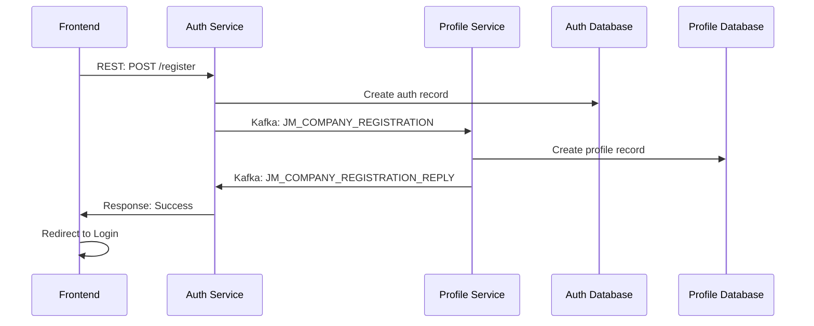

### Flow Details

<Steps>
  <Step title="Frontend Submission">
    User submits registration form with company details
  </Step>
  <Step title="Auth Record Creation">
    Auth Service creates authentication record in database
  </Step>
  <Step title="Profile Event">
    Auth publishes `JM_COMPANY_REGISTRATION` (AVRO) to Profile Service
  </Step>
  <Step title="Profile Creation">
    Profile Service consumes event, creates profile record in database
  </Step>
  <Step title="Reply Event">
    Profile publishes `JM_COMPANY_REGISTRATION_REPLY` (AVRO) to Auth
  </Step>
  <Step title="Response">
    Auth responds to REST request, Frontend redirects to Login
  </Step>
</Steps>

---

## Company Login

Authentication flow with JWT token generation and caching.

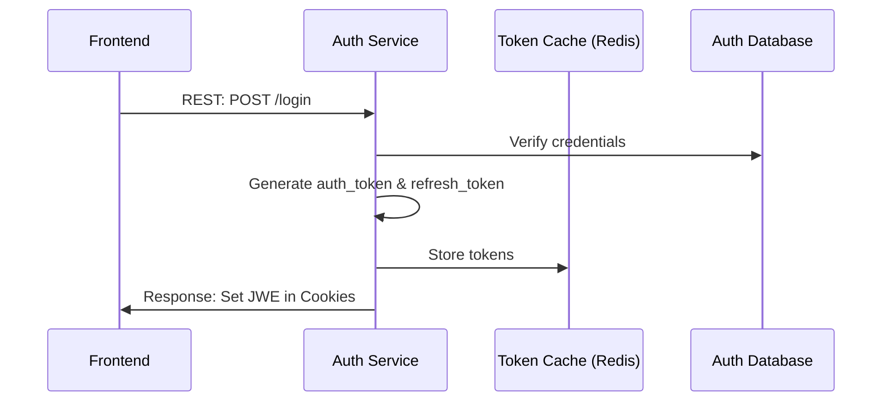

### Flow Details

<Steps>
  <Step title="Credential Submission">
    User submits login form with email and password
  </Step>
  <Step title="Verification">
    Auth Service verifies credentials against database
  </Step>
  <Step title="Token Generation">
    Auth creates `auth_token` and `refresh_token`
  </Step>
  <Step title="Token Caching">
    Tokens stored in Redis Token Cache Database
  </Step>
  <Step title="Response">
    JWE tokens set in browser cookies for session management
  </Step>
</Steps>

---

## Company Profile Management

### Update Company Profile

Direct REST update to Profile Service.

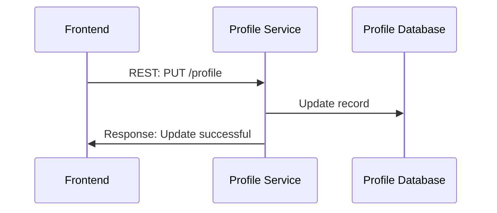

### Upload/Update Company Logo

Media upload with Kafka notification to Profile Service.

<Info>
  **URL Format:** `[company_id]-logo-[filename.*]`
</Info>

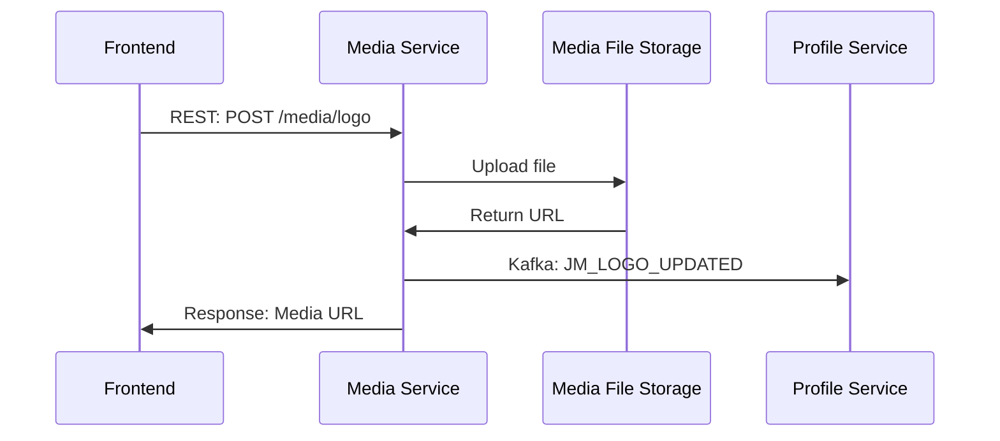

### Upload/Update Images and Videos

Media upload with database record persistence.

<Info>
  **URL Format:** `[company_id]-[image/video]-[filename.*]`
</Info>

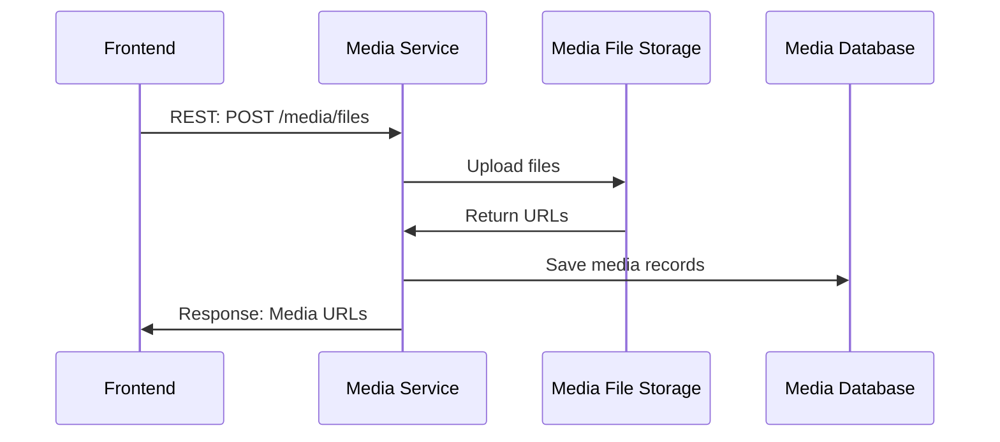

---

## Job Post Management

### Display Applications of Job Post

Cross-system query to JA Backend for application data.

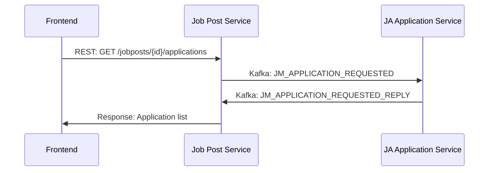

### Archive Application

Update application status with cross-system synchronization.

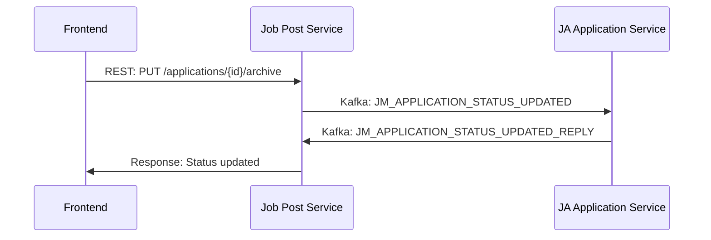

### Create/Update Job Post

Job post lifecycle with skill tag management.

<Info>
  The `JobPost_SkillTag` index table is stored inside the Job Post Database.
</Info>

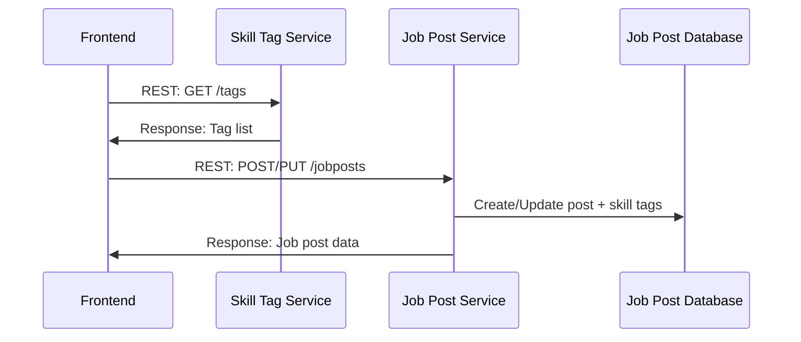

### Search/Manage Skill Tags

Dynamic tag management during job post editing.

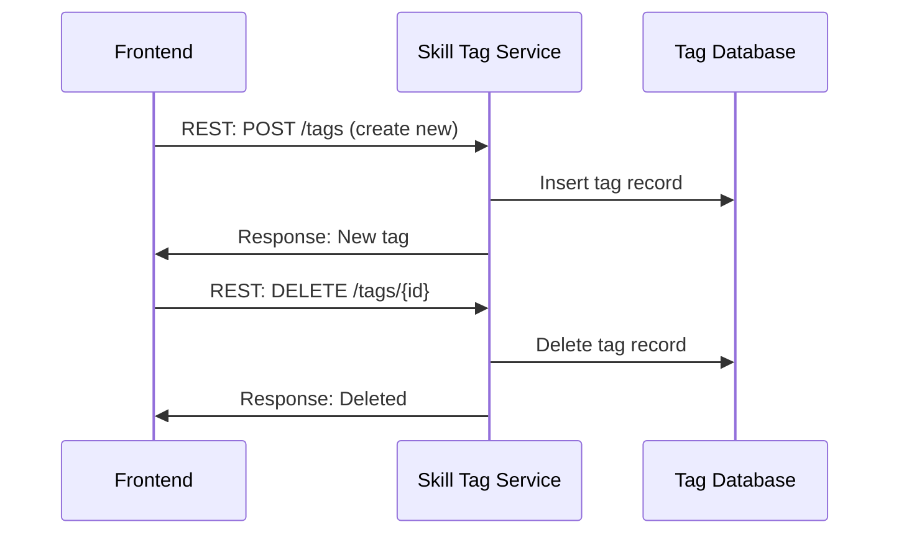

### Real-time Notification on Job Post Changes

Notify matching applicants when job posts are created or updated.

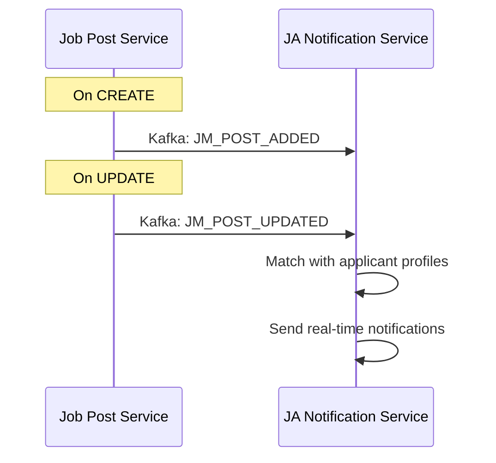

---

## Applicant Search and Marker

### Applicant Search (Search Filter Form)

Cross-system search query to JA Backend.

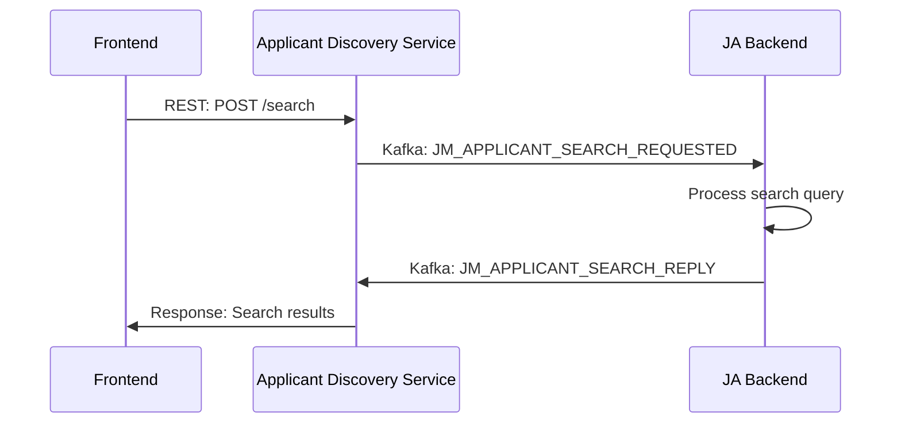

### Applicant Marker

Mark applicants as Favorite or Warning.

<Info>
  The `Company_Applicant_Marker` table is stored inside the Company Profile Database.
</Info>

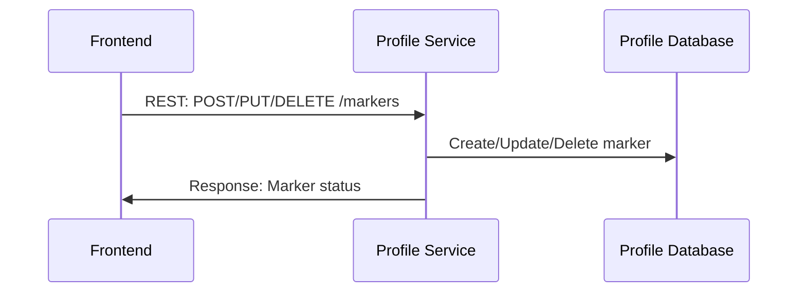

---

## Premium Company Subscription

### Premium Subscription Payment

Payment processing with subscription status update.

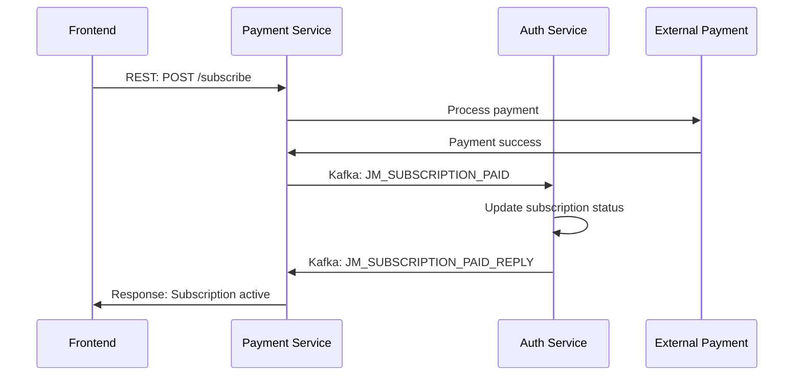

### JA Subscription (Cross-System)

Handle payment requests from Job Applicant system.

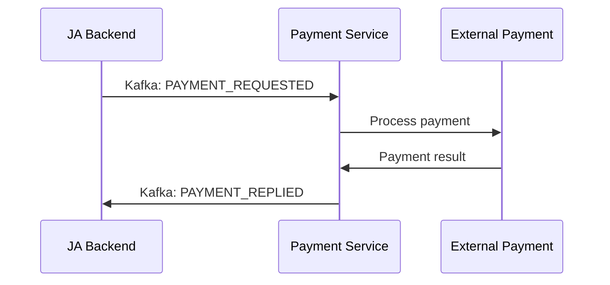

### Subscription Expiration Notification

Automated expiration handling with email and real-time notifications.

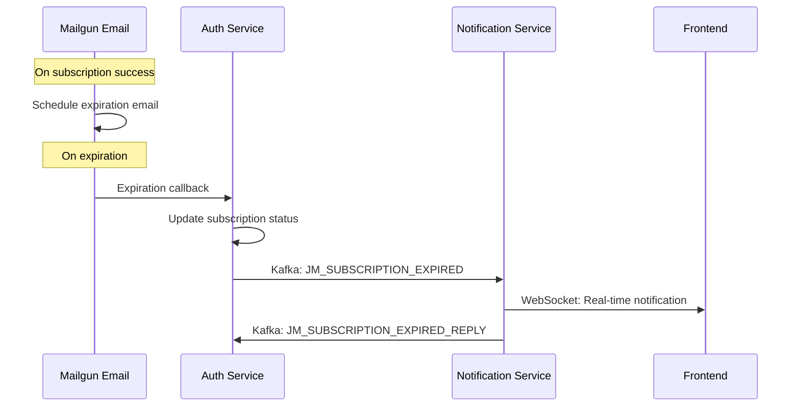

### Extend Subscription

Renewal flow with email notification update.

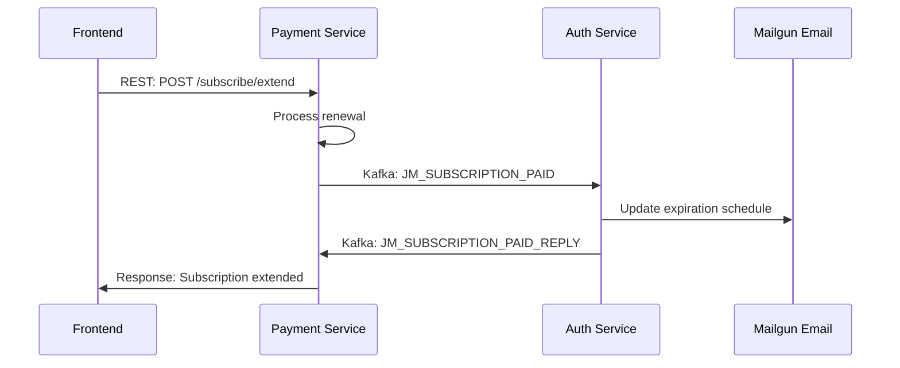

### Applicant Profile Update Notification

Notify premium companies when matching applicants update profiles.

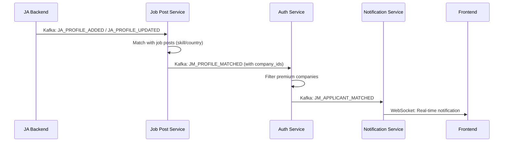

---

## Error Handling Flows

This section documents how the system handles failures, retries, and error recovery across different scenarios.

### Authentication Failure Flow

Handles invalid credentials, account lockout, and token expiration.

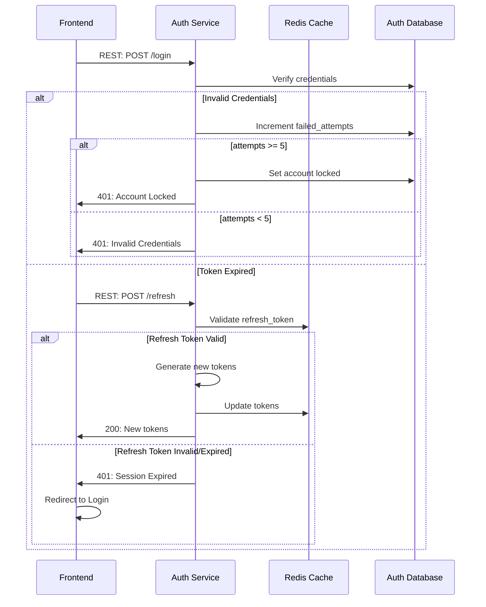

### Kafka Message Failure & Retry Flow

Handles message delivery failures with exponential backoff retry.

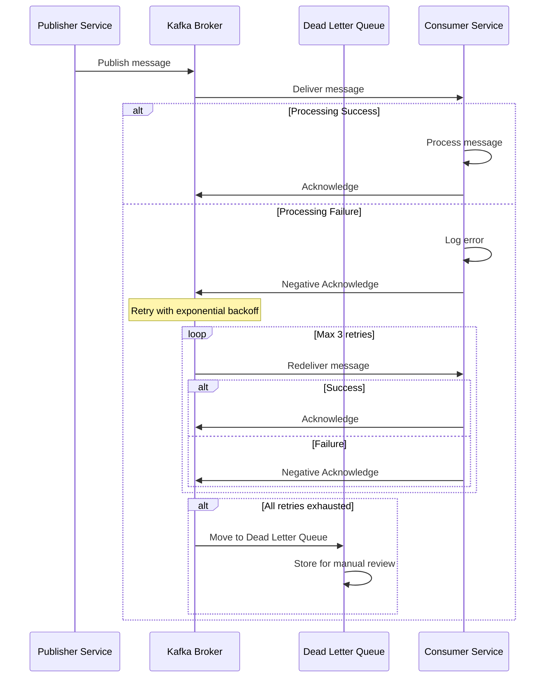

### Payment Failure Flow

Handles payment processing failures and rollback.

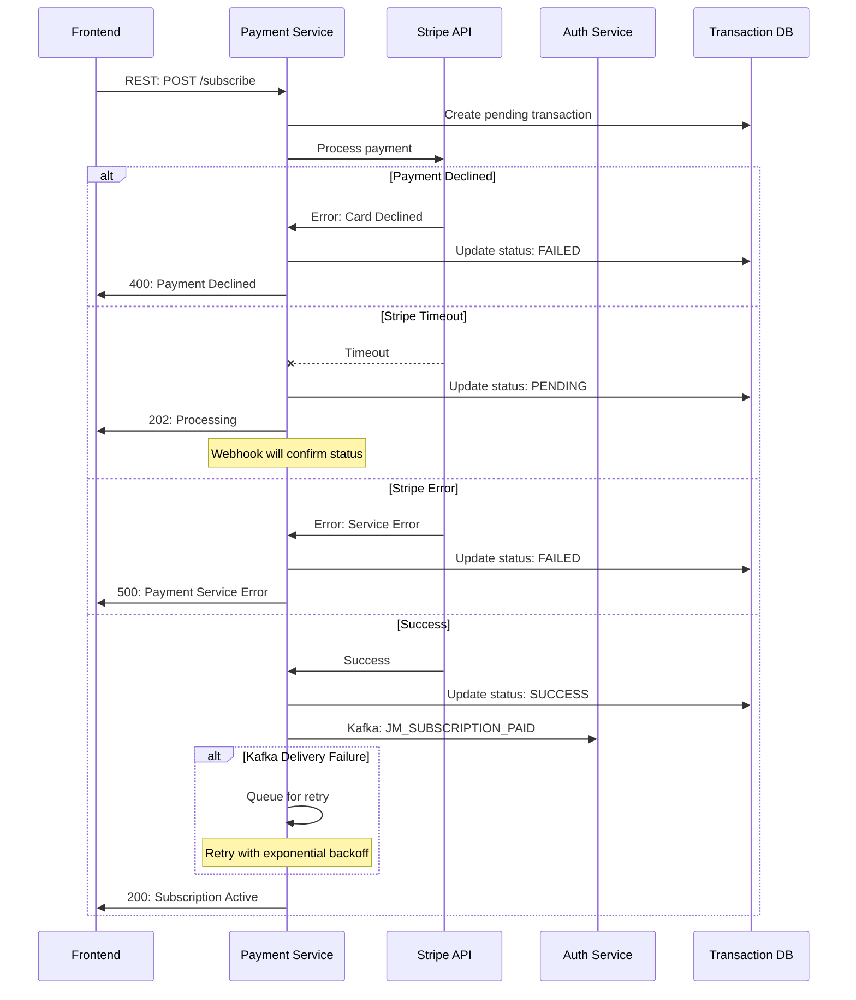

### Cross-Shard Query Failure Flow

Handles failures when querying across database shards.

```mermaid
sequenceDiagram
    participant FE as Frontend
    participant Profile as Profile Service
    participant S1 as Shard 1 (Africa)
    participant S2 as Shard 2 (Europe)
    participant S3 as Shard 3 (Americas)

    FE->>Profile: REST: GET /companies/global-search

    par Query All Shards
        Profile->>S1: Query shard 1
        Profile->>S2: Query shard 2
        Profile->>S3: Query shard 3
    end

    alt All Shards Respond
        S1->>Profile: Results
        S2->>Profile: Results
        S3->>Profile: Results
        Profile->>Profile: Merge results
        Profile->>FE: 200: Combined results
    else Partial Failure
        S1->>Profile: Results
        S2--xProfile: Timeout/Error
        S3->>Profile: Results
        Profile->>Profile: Merge available results
        Profile->>FE: 206: Partial results (degraded)
        Note over FE: Display warning about incomplete data
    else Total Failure
        S1--xProfile: Timeout
        S2--xProfile: Error
        S3--xProfile: Timeout
        Profile->>FE: 503: Service Unavailable
    end
```

### WebSocket Notification Failure Flow

Handles real-time notification delivery failures.

```mermaid
sequenceDiagram
    participant Kafka as Kafka
    participant Notif as Notification Service
    participant WS as WebSocket Server
    participant FE as Frontend
    participant DB as Notification DB

    Kafka->>Notif: JM_APPLICANT_MATCHED
    Notif->>DB: Persist notification
    Notif->>WS: Push to client

    alt Client Connected
        WS->>FE: WebSocket: Notification
        FE->>FE: Display real-time alert
    else Client Disconnected
        WS--xNotif: Connection closed
        Notif->>DB: Mark as undelivered
        Note over DB: Stored for retrieval on reconnect

        FE->>Notif: REST: GET /notifications (on reconnect)
        Notif->>DB: Fetch undelivered
        Notif->>FE: 200: Pending notifications
        FE->>FE: Display missed notifications
    end
```

### Service Circuit Breaker Pattern

Prevents cascade failures when dependent services are unavailable.

```mermaid
sequenceDiagram
    participant Caller as Calling Service
    participant CB as Circuit Breaker
    participant Target as Target Service

    Note over CB: State: CLOSED (normal)

    loop Normal Operations
        Caller->>CB: Request
        CB->>Target: Forward request
        Target->>CB: Response
        CB->>Caller: Response
    end

    Note over CB: Failures accumulate

    loop Failures > Threshold
        Caller->>CB: Request
        CB->>Target: Forward request
        Target--xCB: Error/Timeout
        CB->>CB: Increment failure count
        CB->>Caller: Error response
    end

    Note over CB: State: OPEN (tripped)

    loop Circuit Open
        Caller->>CB: Request
        CB->>Caller: Fast fail (no call to Target)
    end

    Note over CB: After timeout period
    Note over CB: State: HALF-OPEN (testing)

    Caller->>CB: Request
    CB->>Target: Test request

    alt Target Recovered
        Target->>CB: Success
        CB->>CB: Reset failure count
        Note over CB: State: CLOSED
        CB->>Caller: Success
    else Target Still Failing
        Target--xCB: Error
        Note over CB: State: OPEN
        CB->>Caller: Error
    end
```

### Error Response Codes

| Scenario | HTTP Code | Error Code | Recovery Action |
|----------|-----------|------------|-----------------|
| Invalid credentials | 401 | `INVALID_CREDENTIALS` | Retry with correct credentials |
| Account locked | 401 | `ACCOUNT_LOCKED` | Wait 15 minutes or contact support |
| Token expired | 401 | `TOKEN_EXPIRED` | Refresh token or re-login |
| Validation error | 400 | `VALIDATION_ERROR` | Fix input and retry |
| Payment declined | 400 | `PAYMENT_DECLINED` | Try different payment method |
| Resource not found | 404 | `NOT_FOUND` | Check resource ID |
| Rate limited | 429 | `RATE_LIMITED` | Wait and retry with backoff |
| Service unavailable | 503 | `SERVICE_UNAVAILABLE` | Retry after delay |
| Partial data | 206 | `PARTIAL_CONTENT` | Proceed with warning |

---

## Kafka Topics Reference

### JM (Job Manager) Topics

| Topic | Publisher | Consumer | Purpose |
|-------|-----------|----------|---------|
| `JM_COMPANY_REGISTRATION` | Auth | Profile | Create company profile |
| `JM_COMPANY_REGISTRATION_REPLY` | Profile | Auth | Confirm profile created |
| `JM_LOGO_UPDATED` | Media | Profile | Update logo URL |
| `JM_APPLICATION_REQUESTED` | Job Post | JA | Request application data |
| `JM_APPLICATION_REQUESTED_REPLY` | JA | Job Post | Return application data |
| `JM_APPLICATION_STATUS_UPDATED` | Job Post | JA | Update application status |
| `JM_APPLICATION_STATUS_UPDATED_REPLY` | JA | Job Post | Confirm status update |
| `JM_POST_ADDED` | Job Post | JA Notification | New job post notification |
| `JM_POST_UPDATED` | Job Post | JA Notification | Updated job post notification |
| `JM_APPLICANT_SEARCH_REQUESTED` | Applicant Discovery | JA | Search applicants |
| `JM_APPLICANT_SEARCH_REPLY` | JA | Applicant Discovery | Return search results |
| `JM_SUBSCRIPTION_PAID` | Payment | Auth | Update subscription status |
| `JM_SUBSCRIPTION_PAID_REPLY` | Auth | Payment | Confirm status update |
| `JM_SUBSCRIPTION_EXPIRED` | Auth | Notification | Expiration alert |
| `JM_SUBSCRIPTION_EXPIRED_REPLY` | Notification | Auth | Confirm notification sent |
| `JM_PROFILE_MATCHED` | Job Post | Auth | Matched company IDs |
| `JM_APPLICANT_MATCHED` | Auth | Notification | Notify premium companies |

### JA (Job Applicant) Topics

| Topic | Publisher | Consumer | Purpose |
|-------|-----------|----------|---------|
| `JA_PROFILE_ADDED` | JA | Job Post | New applicant profile |
| `JA_PROFILE_UPDATED` | JA | Job Post | Updated applicant profile |
| `PAYMENT_REQUESTED` | JA | Payment | Applicant payment request |
| `PAYMENT_REPLIED` | Payment | JA | Payment result |

---

## Related Documentation

- [System Architecture](/technical/architecture)
- [Backend Components](/technical/backend-components)
- [Data Model](/technical/data-model)
